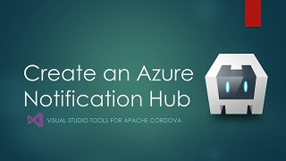
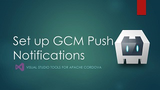
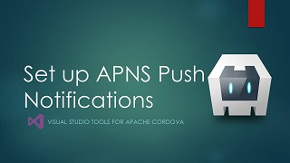
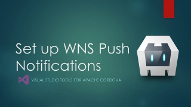
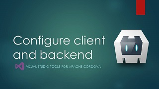

<properties
   pageTitle="Add Azure App Service Mobile App | Cordova"
   description="Access Data in your Apache Cordova app"
   services="na"
   documentationCenter=""
   authors="mikejo5000"
   tags=""/>
<tags ms.technology="cordova" ms.prod="visual-studio-dev14"
   ms.service="na"
   ms.devlang="javascript"
   ms.topic="article"
   ms.tgt_pltfrm="mobile-multiple"
   ms.workload="na"
   ms.date="01/26/2016"
   ms.author="mikejo5000"/>

#Add Azure App Service Mobile App

##Overview

Azure App Service is a cloud app service that integrates everything you need to quickly and easily build
[web](https://azure.microsoft.com/en-us/services/app-service/web/) and [mobile](https://azure.microsoft.com/en-us/services/app-service/mobile/)
apps for any platform or device.

With the [Mobile Apps](https://azure.microsoft.com/en-us/documentation/learning-paths/appservice-mobileapps/) feature of Azure App Service,
it’s easy to rapidly build engaging Cordova apps. Azure mobile apps helps you to easily authenticate users, access the cloud data and send
push notifications. You can create a no code backend in minutes and extend it to add custom logic C# or Node.js as you would like.

The tasks in this article show you how to create an Azure Mobile App that uses an Azure Easy table for data storage and supports push notifications for Android, iOS, and Windows.

##Prerequisites: Get the Azure connected services client app

To get the sample used in this Azure connected services tutorial, go here:
https://github.com/Microsoft/cordova-samples/tree/master/azure-connected-services

Download the sample and open it in Visual Studio.

##Task 1: Create an Azure Mobile App backend

On the Azure portal, create an Azure Mobile App backend. Follow steps in this video to create the Azure Mobile App backend. You will need to create an Azure account if you don't have one.

<a href="https://www.youtube.com/watch?v=oKWEXU8i5oc" class="video" title="Create an Azure Mobile App">

For documentation that shows similar steps, see the [Getting Started Tutorial](https://azure.microsoft.com/en-us/documentation/articles/app-service-mobile-cordova-get-started/). You can skip the section on downloading the client app.

>**Note**: You can follow steps described in the [Getting Started Tutorial](https://azure.microsoft.com/en-us/documentation/articles/app-service-mobile-cordova-get-started/) to download the Azure sample, but if you use the getting started sample instead of the Azure connected services sample, you must take extra steps to add required plugins, to add push notification code, and to update the Cordova version in your app.

##Task 2: Update your Cordova app and your Mobile App backend code

The Azure connected services sample uses an Azure Easy table to store todolist items. To use the sample, update your Cordova sample app:

* Include your Azure Mobile App connected service URL where directed in index.js.
* Include the same URL in the CSP `<meta>` element in index.html.

The client app uses push notification templates to register devices for push notification service. This allows you to use platform-agnostic backend code in your Azure Mobile App. To begin the tasks to support push notifications in Azure, first add the backend code to the todoitem.js file in your Azure Easy table (go to **Settings** > **Easy tables** > **TodoItem** > **Edit Script**). For a Node.js backend, use this code.

```javascript
var azureMobileApps = require('azure-mobile-apps'),
promises = require('azure-mobile-apps/src/utilities/promises'),
logger = require('azure-mobile-apps/src/logger');

var table = azureMobileApps.table();

table.insert(function (context) {
// For more information about the Notification Hubs JavaScript SDK,
// see http://aka.ms/nodejshubs
logger.info('Running TodoItem.insert');

// Define the template payload.
var payload = '{"messageParam": "' + context.item.text + '" }';  

// Execute the insert.  The insert returns the results as a Promise,
// Do the push as a post-execute action within the promise flow.
return context.execute()
    .then(function (results) {
        // Only do the push if configured
        if (context.push) {
            // Send a template notification.
            context.push.send(null, payload, function (error) {
                if (error) {
                    logger.error('Error while sending push notification: ', error);
                } else {
                    logger.info('Push notification sent successfully!');
                }
            });
        }
        // Don't forget to return the results from the context.execute()
        return results;
    })
    .catch(function (error) {
        logger.error('Error while running context.execute: ', error);
    });
});

module.exports = table;  
```

To use a .NET backend code, follow steps in the [Update the server project](https://azure.microsoft.com/en-us/documentation/articles/app-service-mobile-xamarin-forms-get-started-push/#update-the-server-project-to-send-push-notifications) section of this Xamarin article.

To use push notifications in the sample, follow the other tasks in this article to create an Azure notification hub and to configure platform-specific notification services (GCM, APNS, and WNS) for the devices that you are targeting.

##Task 3: Create an Azure push notification hub

If you want to add support for push notifications to your Azure Mobile App, follow steps in this video.

<a href="https://www.youtube.com/watch?v=ERLF0o60-04" class="video" title="Create an Azure Notification Hub">

To follow the same steps in the tutorial, see [Create a notification hub](https://azure.microsoft.com/en-us/documentation/articles/app-service-mobile-xamarin-forms-get-started-push/#create-hub).

##Task 4: (Optional) Configure Google Cloud Messaging (GCM)

If you want to send push notifications to Android devices, you must configure GCM and add the GCM credentials to your notification hub. Follow steps in this video.

<a href="https://www.youtube.com/watch?v=OSDKh_5R6vo" class="video" title="Configure GCM">

To follow the same steps in the tutorial, see [Enable Google Cloud Messaging](https://azure.microsoft.com/en-us/documentation/articles/app-service-mobile-xamarin-forms-get-started-push/#optional-configure-and-run-the-android-project).

##Task 5: (Optional) Configure Apple Push Notification Service (APNS)

If you want to send push notifications to iOS devices, you must configure APNS and add the APNS credentials to your notification hub. Follow steps in this video.

<a href="https://www.youtube.com/watch?v=VzJxTcpUXCY" class="video" title="Configure APNS">

##Task 6: (Optional) Configure Windows Notification Service (WNS)

If you want to send push notifications to Windows devices, you must configure WNS and add the WNS credentials to your notification hub. Follow steps in this video.

<a href="https://www.youtube.com/watch?v=9pc4GglHNsY" class="video" title="Configure WNS">

##Task 7: Get ready to run your app!

Watch this video to make sure your app is ready to handle push notifications:

<a href="https://www.youtube.com/watch?v=C8L62__8TLg" class="video" title="Configure Cordova client app and backend">

To test push notifications in your Android app:

Follow the steps in [Test push notifications in your Android app](https://azure.microsoft.com/en-us/documentation/articles/app-service-mobile-xamarin-forms-get-started-push/#optional-configure-and-run-the-android-project).

>**Note**: If you need to run on the Google Android Emulator instead of a device (a device is recommended), see [Test push notifications in your app](https://azure.microsoft.com/en-us/documentation/articles/app-service-mobile-xamarin-android-get-started-push/#test).

To test push notifications in your iOS app:

1. Go through the steps in the [iOS Setup Guide](http://taco.visualstudio.com/en-us/docs/ios-guide/) to install and run the remotebuild agent.

    Make sure you can build the app for iOS. The steps in the setup guide are required to build for iOS from Visual Studio. If you do not have a Mac, you can build for iOS using the remotebuild agent on a service like MacInCloud. For more info, see [Run your iOS app in the cloud](http://taco.visualstudio.com/en-us/docs/build_ios_cloud/).

2. In Visual Studio, make sure that **iOS** is selected as the deployment target, and then choose **Device** to run on your connected iOS device.

	You can run on an iOS device connected to your PC using iTunes. The iOS Simulator does not support push notifications.

3. Press the **Run** button or **F5** in Visual Studio to build the project and start the app in an iOS device, then click **OK** to accept push notifications.

	>**Note**: You must explicitly accept push notifications from your app. This request only occurs the first time that the app runs.

4. In the app, type a task, and then click the plus (+) icon.

5. Verify that a notification is received, then click OK to dismiss the notification.

To test push notifications in your Windows App:

1. In Visual Studio, make sure that a Windows platform is selected as the deployment target, such as **Windows-x64** or **Windows-x86**. To run the app on a Windows 10 PC hosting Visual Studio, choose **Local Machine**.

2. Press the Run button to build the project and start the app.

3. In the app, type a name for a new todoitem, and then click the plus (+) icon to add it.

4. Verify that a notification is received when the item is added.

##Task 8: Add authentication

To add authentication to your app, see the article, [How to: Authenticate users](https://azure.microsoft.com/en-us/documentation/articles/app-service-mobile-cordova-get-started-users/)

##Troubleshooting: Let's fix it

* Platform notification service (PNS) credentials won't validate in Azure notification hub?

    At present, detailed error information is not provided. Check to make sure that any credentials you previously entered for another PNS (GCM, APNS, or WNS) are still valid.

    If you need more detailed error messages, you can log in through the Azure Classic portal to enter your PNS credentials.

* Can't register device or device does not receive push notifications?

    Use the Server Explorer in Visual Studio to [make sure your device is getting registered](https://azure.microsoft.com/en-us/documentation/articles/notification-hubs-push-notification-fixer/#self-diagnose-tips) with push notification services.

    In Azure, open **Settings** > **Diagnostic logs**, and enable application logging, web server logging (file system), and detailed error messages. Then, while sending push notifications, view your Log stream (**Tools** > **Log stream**).

* Can't get push notifications to work on Windows Phone 8.1.

    The PhoneGap push plugin has been validated on Windows 10 only. To target Windows 10, you must set Windows 10 as the target in config.xml.

* Visual Studio Emulator for Android doesn't show push notifications?

    Push notifications are not supported on the VS Emulator for Android. Try to test on an Android device. The Google Android Emulator does support push notifications, but requires [special configuration steps](https://azure.microsoft.com/en-us/documentation/articles/app-service-mobile-xamarin-android-get-started-push/#test).

* Other build or deployment errors in your Cordova app?

    [See Cordova troubleshooting tips](http://taco.visualstudio.com/en-us/docs/tips-and-workarounds-general-readme/#resolve-build-and-deployment-errors-when-you-build-for-the-first-time)


##Links

Please refer to the following links to learn how to use Azure Mobile App SDK in your Cordova app.

- [How to: Use the SDK](https://azure.microsoft.com/en-us/documentation/articles/app-service-mobile-cordova-how-to-use-client-library/) (contains code samples)
- [Concepts: Authentication works in Mobile App](https://azure.microsoft.com/en-us/documentation/articles/app-service-mobile-auth/)
- [Concepts: Push Notification Conectps](https://azure.microsoft.com/en-us/documentation/articles/notification-hubs-overview/)
