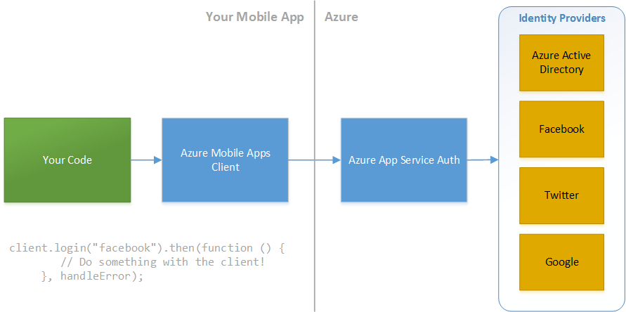
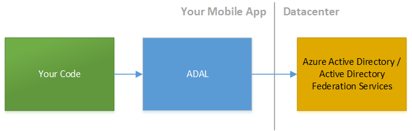
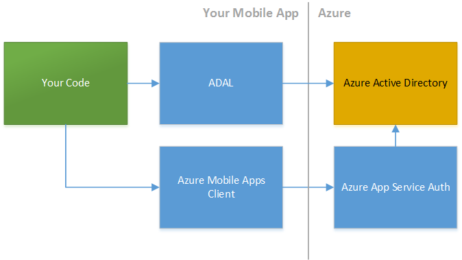

<properties pageTitle="Authenticating users with Azure Mobile Apps or ADAL"
  description="Authenticating users with Azure Mobile Apps or the Active Directory Authentication Library for Cordova."
  services=""
  documentationCenter=""
  authors="clantz" />

# Authenticate users with Azure Mobile Apps or the Active Directory Authentication Library for Cordova
Security is a very broad topic that covers a number of different aspects of an app's lifecycle. Securing an app often represents a number of tradeoffs and key decisions. For the most part you should apply the same [best practices to your code as you do for web apps](https://code.google.com/archive/p/browsersec/wikis/Main.wiki). However, given the increased capabilities Cordova apps are affored, it is important to limit your risk as much as possible. 

A critical task for application security is authenticating and authorizing users accessing your app and its associated local or remote data. In this article we'll touch on some options that can help get you get auth up and running.

##Azure App Service Auth and Azure Mobile Apps
[Azure App Service](https://azure.microsoft.com/en-us/services/app-service/) is a suite of services designed to help you build great web and mobile apps. [Azure Mobile Apps](https://azure.microsoft.com/en-us/services/app-service/mobile/) are mobile integrated client apps that take advantage of features within the broader Azure App Service including Web Apps and API Apps along with some additional useful features and client libraries.

A core first step in accessing all of these great services, however, is authorizing users both to access the app for the app to then access data in the cloud. Fortunately, the Cordova plugin for Azure Mobile Apps has an unified authentication interface that currently supports authenticating against Azure Active Directory, Facebook, Google, Twitter, and Microsoft accounts. The unified interface means that you're abstracted from downstream changes and can expect additional provider options and features in the future to streamline things even more. 



You can add it to your app as follows:

1. In Visual Studio, simply click "Add" on the **Azure Mobile Apps** plugin in the **config.xml designer.**
2. When using the command line or Visual Studio Code, you can add the plugin using the Cordova CLI as follows:

    ```
    cordova plugin add cordova-plugin-ms-azure-mobile-apps --save
    ```

See the **[Azure Mobile Apps authentication documentation](https://azure.microsoft.com/en-us/documentation/articles/app-service-mobile-cordova-get-started-users/)** and the article on **[securely transmitting data](./cordova-security-xmit.md)** for additional details on token passing.

Note that you can also get basic information about the user logged in by making a REST call to the **/.auth/me** service endpoint. The [securely transmitting data](./cordova-security-xmit.md) article has a code sample.

##Active Directory Authentication Library for Cordova
Active Directory (AD) provides an industry leading identity server both in the cloud and on-premises through Azure Active Directory (AAD) and Active Directory Federation Services (ADFS). You can securely authenticate, authorize, access information in AD, and take advantage of device level single sign on and multi-factor authentication (MFA) capabilities through the powerful Active Directory Authentication Library (ADAL) available for all major native and cross-platform mobile and server side technologies. **Note that the ADAL plugin is currently in preview.**

For Cordova this functionality is provided via the ADAL plugin which can be used both with AAD and on-premises ADFS v3 and up. It user the Android, iOS, and .NET native libraries under the covers and therefore persists auth tokens in a secure cache that you can then query to pass to downstream services.



Adding the plugin is easy.

1. In Visual Studio, simply click "Add" on the **ADAL for Cordova** plugin in the **config.xml designer.**
2. When using the command line or Visual Studio Code, you can add the plugin using the Cordova CLI as follows:

    ```
    cordova plugin add cordova-plugin-ms-adal --save
    ```
   
See the **[Active Directory Quick Start for Cordova](https://azure.microsoft.com/en-us/documentation/articles/active-directory-devquickstarts-cordova/)** for additional details on setup. You can also read [this blog post](http://www.cloudidentity.com/blog/2015/04/06/adal-plugin-for-apache-cordova-deep-dive/) on some of the internals and the advantages it provides over other methods. 

While the quick start uses Azure AD, the plugin also works with **ADFS v3** and up by simply changing the authority and redirect URIs to the appropriate ones for your ADFS installation.

The quick start also has code that demonstrates calling the [Azure AD Graph REST API](https://msdn.microsoft.com/en-us/library/azure/hh974476.aspx) directly using an AD token from the plugin. This approach can be reused across Azure services and O365 services. See the article on [securely transmitting data](./cordova-security-xmit.md) along with documentation on [Azure JSON based REST APIs](https://msdn.microsoft.com/en-us/library/azure/hh974476.aspx) and [O365](http://dev.office.com/getting-started/office365apis) for additional details on token passing to downstream services.

###ADAL and Azure Mobile Apps or Azure App Service
Note that if you would prefer to use the ADAL plugin to authenticate users in your app, you can still pass the token you get from ADAL into the Mobile Apps client mentioned above for interacting with services where you have enabled Azure AD.



First, carefully follow all setup steps under **[(Optional) Configure a native client application](https://azure.microsoft.com/en-us/documentation/articles/app-service-mobile-how-to-configure-active-directory-authentication/)** in the Azure App Service AD auth article. You can then login to Azure Mobile Apps using the auth token from ADAL as follows:

```javascript
var client = new WindowsAzure.MobileServiceClient(appUrl);

client.login("aad", {"access_token": tokenFromADAL})
    .then(function () {
        // Do something with the client!
     }, handleError);
```

##JavaScript & 3rd Party Options
Cordova also can take advantage of pure JavaScript based solutions to authenticate against Oauth providers thanks to the **InAppBrowser** plugin. See [this article](http://phonegap-tips.com/articles/google-api-oauth-with-phonegaps-inappbrowser.html) for an excellent overview on the general approach JavaScript based solutions take. These options can be useful when client libraries are not available. The **[ngCordovaOauth](https://github.com/nraboy/ng-cordova-oauth)** library encapsulates this approach to allow you to target an impressive array of different Oauth providors including on-prem ADFS. However, in general we recommend using provider Cordova plugins, the ADAL plugin, or Azure when security is of paramount concern.

If neither of the above options meet your needs, there are a number of 3rd party solutions that may be of use. First note that many Single Sign-On (SSO) solutions including [Auth0](https://auth0.com/) actually provide Cordova plugins or explictly support Cordova in their JavaScript client libraries. If you already have a SSO provider, be sure to check with them to see what best practices they provide for Cordova apps.

##Additional Security Topics
- [Learn about Cordova platform and app security features](./cordova-security-platform.md)
- [Encrypt your local app data](./cordova-security-data.md)
- [Learn about securely transmitting data](./cordova-security-xmit.md)
- [Detect potential security threats](./cordova-security-detect.md)
- [Quickly remediate security issues](./cordova-security-fix.md)
