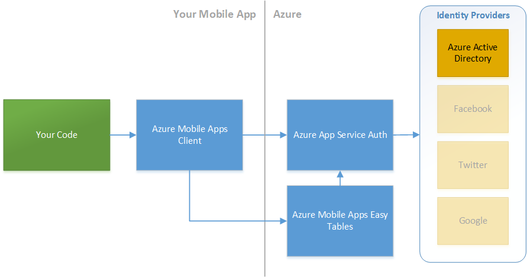
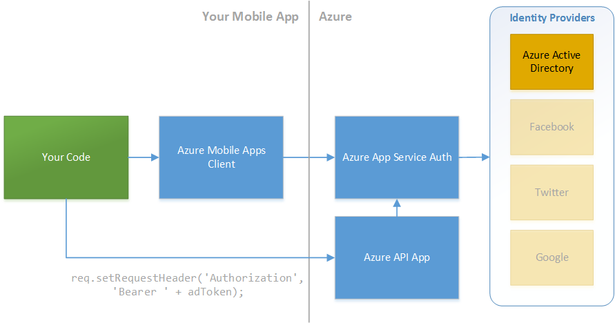

<properties pageTitle="Securing Cordova app data using encryption, SSL, Intune, and Azure Mobile Apps"
  description="Secure Cordova app data using encryption, SSL, certificate pinning. Use the Intune MAM App SDK, Azure Mobile Apps, and the Azure App Service to speed up your workflow."
  services=""
  documentationCenter=""
  authors="clantz" />

# Secure and encrypt your Cordova app data at rest and over the wire
Security is a very broad topic that covers a number of different aspects of an app's lifecycle. Securing an app often represents a number of tradeoffs and key decisions. Like the web, Cordova is a very open platform and as a result it does not force you down a specific path that will always guarantee a secure app. Instead provides a set of tools that you can use to lock down your app as appropriate. 

For the most part you should apply the same [best practices to your code as you do for web apps](https://code.google.com/archive/p/browsersec/wikis/Main.wiki). However, given the increased capabilities Cordova apps are afforded, it is important to limit your risk as much as possible. This document will outline some of the security features that exist in Cordova, community plugins, and related Microsoft products for encrypting data locally and transmitting it securely. 

## Adding plugins mentioned in this article
A number of the plugins in this article are not in the Visual Studio config.xml designer. You can add these plugins as follows:

1. In Visual Studio, right click on config.xml, select View Code, and then add one of the following depending on whether or not a Git URI needs to be used. The plugin will be added on next build.
    ```
    <plugin name="cordova-sqlite-storage" spec="~0.8.2" />
    <plugin name="io.litehelpers.cordova.sqlcipher" src="https://github.com/litehelpers/Cordova-sqlcipher-adapter.git" version="0.1.4-rc" />
    ```
    ...or for Cordova < 5.1.1...
    ```
    <vs:plugin name="cordova-sqlite-storage" version="0.8.2" />
    <vs:plugin name="io.litehelpers.cordova.sqlcipher" src="https://github.com/litehelpers/Cordova-sqlcipher-adapter.git" version="0.1.4-rc" />
    ```

2. When using the command line or Visual Studio Code, you can add the plugin using the Cordova CLI as follows:

    ```
    cordova plugin add cordova-sqlite-storage --save
    cordova plugin add https://github.com/litehelpers/Cordova-sqlcipher-adapter.git --save
    ```

##Secure locally stored data
Storing data locally is relatively straight forward with Cordova but securing it can be a bit more difficult. Generally using JavaScript based encryption schemes is a bad practice and [not considered secure](https://www.nccgroup.trust/us/about-us/newsroom-and-events/blog/2011/august/javascript-cryptography-considered-harmful/) and local and file storage are not encrypted. That said, features like [Apple's much discussed data protection](https://support.apple.com/en-us/HT202064) can be enabled by simply setting a PIN which products like Intune can force to happen for your app. However, and you may have multi-tenet requirements where data separation is required when multiple users access the same device or you would simply prefer to add an extra layer of app security by encrypting your local app data.

Here are some recommendations that can help encrypt sensitive data in Cordova apps. 

###Encrypt data using Web Crypto via Crosswalk and a shim
The best starting point whenever you are tackling a problem related to security is to rely on browser features as they undergo significant testing and have abundant real-world use going for them. Web Crypto is a W3C standard that lets the browser itself encrypt data. Historically [crypto.subtle.encrypt and decrypt](https://developer.mozilla.org/en-US/docs/Web/API/SubtleCrypto) has [varying levels of support](http://caniuse.com/#search=web%20crypto) in browsers with one in particular being the biggest problem for Cordova: Android. 

#### Crosswalk
Thankfully, the [Crosswalk WebView Engine plugin](https://www.npmjs.com/package/cordova-plugin-crosswalk-webview) brings Android 4.0+ up to a recent version of Chromium including Web Crypto support. 

See the article on **[improving Android browser consistency and features with the Crosswalk WebView](../develop-apps/cordova-crosswalk.md)** for additional details on setup including some important information on **emulator config**. 

Note that Crosswalk 14 can cause a crash when using Web Crypto and Crosswalk 16 has caused crashes in certain emulators. Crosswalk 15 appears to be a solid choice. If you run into unexpected crashes or odd behaviors, add this to config.xml (Right-Click &gt; View Code in VS):

```
<preference name="xwalkVersion" value="org.xwalk:xwalk_core_library:15+" />
```

You should only add this preference if you encounter issues as it disables useful features like "Shared Mode".

#### webcrypto-shim
iOS supports crypto.subtle with a webkit prefix and IE 11 and up also support web crypto but with a slightly different syntax. Thankfully, an API shim like [webcrypto-shim](https://github.com/vibornoff/webcrypto-shim) can resolve these differences for you such that the combination of Crosswalk in the shim give you native encryption capabilities.

In general, this is your best starting point. If for some reason you cannot use Crosswalk or are looking for more holistic solutions, there are community plugins and other solutions that can help.  

#### Example
Here is a small code sample that demonstrates using Web Crypto to encrypt a string on Android, iOS, and Windows after adding the **[cordova-plugin-crosswalk-webview](https://www.npmjs.com/package/cordova-plugin-crosswalk-webview)** plugin to your project and referencing **[webcrypto-shim.js](https://github.com/vibornoff/webcrypto-shim)** and **[promiz.js](https://github.com/Zolmeister/promiz)** in your HTML.

First, crypto.subtle.encrypt and decrypt uses ArrayBuffers rather than strings or other types, so for this example we'll take advantage of two useful functions from [Google Developers](https://developers.google.com/web/updates/2012/06/How-to-convert-ArrayBuffer-to-and-from-String) for type conversion of as string.

```javascript
function stringToArrayBuffer(str) {
    var buf = new ArrayBuffer(str.length*2); // 2 bytes for each char
    var bufView = new Uint16Array(buf);
    for (var i=0, strLen=str.length; i < strLen; i++) {
        bufView[i] = str.charCodeAt(i);
    }
    return buf;
};

function arrayBufferToString(buf) {
    return String.fromCharCode.apply(null, new Uint16Array(buf));
};
```
Next we will generate an encryption key and then encrypt a string using crypto.subtle.encrypt.
```javascript
var stringToEncrypt = "Hey! Encrypt me!";

// Setup AES-CBC encryption
var randomVals = new Uint8Array(16);
crypto.getRandomValues(randomVals);
var cryptoSubtleAlgo = { "name": "AES-CBC", "length": 256, "iv": randomVals };

// Generate a key, encrypt
crypto.subtle.generateKey(cryptoSubtleAlgo, true, ["encrypt", "decrypt"])
    .then(function (key) {
        return crypto.subtle.encrypt(cryptoSubtleAlgo, key, stringToArrayBuffer(stringToEncrypt))
    })
    .then(function (result) {
        // Log encrypted string
        console.log("Before: " + stringToEncrypt);
        console.log("After: " + arrayBufferToString(result));
    });
```

###Use the Intune MAM to force encryption
[Microsoft Intune](https://www.microsoft.com/en-us/server-cloud/products/microsoft-intune/) is a [mobile application management](https://en.wikipedia.org/wiki/Mobile_application_management) (MAM) and [mobile device management](https://en.wikipedia.org/wiki/Mobile_device_management) (MDM) platform that supports Android, iOS, and Windows devices. Intune's MAM capabilities can be used without managing devices which means it can be used in combination with existing MDM solutions like Airwatch and Mobile Iron. Currently it is targeted at Active Directory authorized apps and thus is most applicable to enterprise focused scenarios. It provides the ability to enforce policies at the **app level** including encryption of all local data. It's therefore a low friction way to increase your security. 

Intune provides two solutions for enabling its MAM features for Android and iOS devices: an app wrapping tool and an app SDK. The app wrapping tool that can be run on any Android or iOS app to light up certain capabilities like limiting cut-copy-paste while the app is running, forcing a PIN, or forcing encryption. The Intune App SDK takes this a step farther adds in multi-tenet encryption that goes beyond OS level data protection features and ensures data separation when multiple users access the same device. See [Microsoft Intune documentation](https://technet.microsoft.com/en-us/library/mt631425.aspx) for a comparison of the features provided by the app wrapping tool and the App SDK.

The app wrapping tool is generally available. While the Android and iOS native App SDKs are generally available, the Intune App SDK Cordova plugin that uses them is [currently in beta](https://blogs.msdn.microsoft.com/visualstudio/2015/11/18/announcing-the-intune-app-sdk/). If you are interested in the beta plugin, see the **[announcement blog post](https://blogs.msdn.microsoft.com/visualstudio/2015/11/18/announcing-the-intune-app-sdk/)** for more details getting access and stay tuned for the upcoming GA announcement. Otherwise see the Intune documentation on the **[Android](https://technet.microsoft.com/en-us/library/mt147413.aspx)** and **[iOS](https://technet.microsoft.com/en-us/library/dn878028.aspx) app wrapping tools** for more information.

###Consider community plugins
In addition to the above base capabilities there are a number of community plugins that can be used to encrypt data locally. Microsoft does not directly support these plugins, so security focused organizations should be sure to run a static and or dynamic code analysis tool on the resulting project code (including these plugins) during any planned security audits.

<style>
    table, th, td {
        border: 1px solid black;
        border-collapse: collapse;
    }
    th, td {
        padding: 5px;
    }
</style>
<table><thead>
<tr>
<td align="left"><strong>Topic</strong></td>
<td align="left"><strong>Plugin</strong></td>
<td align="left"><strong>Purpose</strong></td>
<td align="left"><strong>Platform Support</strong></td>
</tr>
</thead><tbody>
<tr>
<td align="left">Token / Secret Storage</td>
<td align="left"><strong><a href="https://www.npmjs.com/package/cordova-plugin-secure-storage">cordova-plugin-secure-storage</a></strong></td>
<td align="left"><p>The plugin allows your application to securely store secrets such as auth tokens or encryption keys in native secure key/token stores.</p>
<p>Note that a side effect of this plugin is it forces users to set a PIN on Android devices (which could be good or bad depending on the situation) since this is required to enable the generation of cryptographic keys.</p>
</td>
<td align="left">Android, iOS</td>
</tr>
<tr>
<td align="left">Encrypted Database</td>
<td align="left"><strong><a href="https://github.com/litehelpers/cordova-sqllite-storage">cordova-sqlite-storage</a></strong> + Web Crypto</td>
<td align="left"><p>The W3C WebSQL API is available on iOS and Android for storing data and can be combined with Web Crypto to store encrypted values in a database. However, WebSQL is limited to 50mb on iOS. There are a set of plugins that use the same API to store data in a SQLite database without storage limits among other features. The edition of this plugin you select will depend on your needs: </p>
<ul>
<li><a href="https://github.com/litehelpers/cordova-sqlite-storage">cordova-sqlite-storage</a> - Base version of the SQLite storage plugin with Android and iOS support. MIT licensed.</li>
<li><a href="https://github.com/litehelpers/cordova-sqlite-ext">cordova-sqlite-ext</a> - SQLite plugin with added Windows 8.1 support (no Windows 10 yet). MIT licensed.</li>
<li><a href="https://github.com/litehelpers/cordova-sqlite-enterprise-free">cordova-sqlite-evfree</a> - An enhanced version of the SQLite plugin targeted at enterprises with additional features. GPL v3 or commercial licensed. You will need to install this version of the plugin using the <strong>Git URI</strong>: https://github.com/litehelpers/cordova-sqlite-enterprise-free.git</li>
<ul>
</td>
<td align="left">Android, iOS, Windows 8.1 (-ext versions)</td>
</tr>
<tr>
<td align="left">Encrypted Database</td>
<td align="left"><strong><a href="https://github.com/litehelpers/cordova-sqlcipher-adapter">cordova-sqlcipher-adapter</a></strong></td>
<td align="left"<p>cordova-sqlcipher-adapter is an in-development enhanced adapter on top of the cordova-sqlite-storage plugin that uses SQLCipher to encrypt all data stored in a local database. You will need to install this version of the plugin using the <strong>Git URI</strong>: https://github.com/litehelpers/cordova-sqlcipher-adapter.git</p></td>
<td align="left">Android, iOS</td>
</tr>
</tbody></table>

###Consider native Windows APIs for Windows
One often missed feature that the Windows platform for Cordova has is the ability to call **any** JavaScript enabled [Windows API](https://msdn.microsoft.com/en-us/library/windows/apps/br211377.aspx) from your Cordova app **without a plugin**. Many plugins for the Windows platforms are simple JavaScript adapters to conform to the plugin interface spec. 

This includes all features contained within the **Windows.Security** and **Windows.Security.Cryptography** namespaces! However, be aware that there may be some variations between Windows 10 and Windows 8.1 APIs depending on which OS you are targeting.

 See **[Windows API documentation](https://msdn.microsoft.com/en-us/library/windows/apps/br211377.aspx)** for additional details and specifics.
 
##Secure data over the wire
###SSL and Auth Tokens
General web best practices apply to Cordova based development including an obvious but sometimes skipped recommendation: **Always use SSL**. While this seems obvious for calls you make that contained sensitive data, it is also important for **any service call that is authenticated** since you will need to pass authentication information like access tokens across in your calls. This is even more important for Cordova since native client authentication [bearer tokens](http://self-issued.info/docs/draft-ietf-oauth-v2-bearer-19.html) often last longer than web based ones. The core assumption is that you are persisting these auth tokens in a secure way when using native API generally not available to the web (such as via library like ADAL that does it for you).

A second related recommendation is to authenticate and authorize all calls using a user login driven authentication token rather than user name and password or an app-level token. The challenges with user name and password are obvious as the information must be passed in clear text. App level authentication or secrets can be acceptable some scenarios, but the downside with this approach is that changing the app authentication will require an app update to accomplish. [Azure Key Vault](https://azure.microsoft.com/en-us/services/key-vault/) can help with situations where you must use an app or service level authentication token / secret / certificate by hiding these values behind a service that is itself authenticated. That said, often it is best to keep these types of service calls behind an app specific service layer that is authenticated against a user rather than having an app call them directly.

#### Use Azure App Service to streamline service auth
Mobile Backend as a Service (MBaaS) solutions can help you get up and running quickly with an authenticated service that can resolve the above challenges. [Azure App Service](https://azure.microsoft.com/en-us/services/app-service/) is specifically designed for this purpose and you can integrate with it easily using the [Azure Mobile Apps](https://azure.microsoft.com/en-us/services/app-service/mobile/) Cordova plugin. See [the Cordova authentication article](./cordova-security-auth.md) for information on adding it to your app. 

The Azure Mobile Apps client taps into Azure App Service Auth on the server side which means you'll be able to quickly connect to authenticated, custom server [App Service "API Apps"](https://azure.microsoft.com/en-us/documentation/articles/app-service-api-authentication/) or other services that also use App Service Auth. You can see how to setup user authentication for service calls [in the App Service API apps documentation.](https://azure.microsoft.com/en-us/documentation/articles/app-service-api-dotnet-user-principal-auth/) Cordova apps can call JSON and REST based services without client libraries can quite easily as we will demonstrate in the next section.




Note that if you would prefer to use the ADAL plugin to authenticate users in your app, you can still pass the token you get from ADAL into the Mobile Apps client for interacting with the server.

```javascript
var client = WindowsAzure.MobileServicesClient(appUrl);

client.login("aad", {"access_token": tokenFromADAL})
    .then(function () {
        // Do something with the client!
     }, handleError);
```

See the [the Cordova authentication article](./cordova-security-auth.md), [Azure Mobile Apps](https://azure.microsoft.com/en-us/documentation/articles/app-service-mobile-value-prop/), and [Azure App Service Auth](https://azure.microsoft.com/en-us/documentation/articles/app-service-api-authentication/) documentation for additional details

#### Pass auth tokens when using REST APIs directly
Cordova's JavaScript based approach makes calling JSON based REST services easy. The [Azure Active Directory Quick Start](https://azure.microsoft.com/en-us/documentation/articles/active-directory-devquickstarts-cordova/) has code that demonstrates calling the Azure AD Graph REST API directly using an AD token from the ADAL Cordova plugin as the auth [bearer token](http://self-issued.info/docs/draft-ietf-oauth-v2-bearer-19.html). 

This same general approach can be applied when using the Azure Mobile Apps client when calling an Azure App Service API App as well.  The key is getting the access token, passing it along to the downstream service, and having the service validate it.



Here's a simplified code example that goes against the publicly available AD Graph API:

```javascript
function get10UsersFromADGraph(adTenantId, adToken, callback) {
    var req = new XMLHttpRequest();
    req.open("GET", "https://graph.windows.net/" + adTenantId + "/users?api-version=2013-11-08&$top=10", true);
    
    // Pass in the ADAL token in the request 
    req.setRequestHeader("Authorization", "Bearer " + adToken);

    req.onload = function(e) {
        if (e.target.status >= 200 && e.target.status < 300) {
            // Call callback function with resulting JSON from API
            callback(JSON.parse(e.target.response));
            return;
        } else {
            console.error("Call failed: " + e.target.response);        
        }    
    };
    req.onerror = function(e) {
        console.error("Call failed: " + e.error);
    };

    req.send();
}
```

This general approach can be reused for custom services and services across Azure and O365 services including your own [custom API Apps](https://azure.microsoft.com/en-us/documentation/articles/app-service-api-authentication/). See documentation on [Azure JSON based REST APIs](https://msdn.microsoft.com/en-us/library/azure/hh974476.aspx) and [O365](http://dev.office.com/getting-started/office365apis) service documentation for additional details on token passing to down-stream services. 

###Certificate Pinning
Another trick used in high security situations is something called [certificate pinning](https://www.owasp.org/index.php/Certificate_and_Public_Key_Pinning). The idea here is you can significantly reduce the chances of a [man-in-the-middle attack](https://en.wikipedia.org/wiki/Man-in-the-middle_attack) by "pinning" the allowed public certificates accepted by your app when making the connection to highly trusted, official certificate authorities (like Verisign, Geotrust, GoDaddy) that you are actually using. The end result is that someone trying to execute a man in the middle attack would need a valid SSL certificate from that specific authority to trick your app into connecting to it.

Cordova and most underlying native webviews unfortunately do not generally support this out-of-box. You can technically approximate certificate pinning as described in the [Cordova Security Guide](https://cordova.apache.org/docs/en/6.0.0/guide/appdev/security/index.html), but the Telerik Verified **[cordova-plugin-http](https://github.com/wymsee/cordova-HTTP)** community plugin is designed to provide an API compatible XML HTTP Request implementation that adds support for certificate pinning among other features to **iOS and Android**. In general it is best to stick with the base XML HTTP Request implementation when making service calls but this plugin can be useful when you are in a particularly high security situation. 

First, get the certificate you want to pin. It should be a DER formatted .cer file.  See [cordova-plugin-http](https://github.com/wymsee/cordova-HTTP) docs for details. Next, place the .cer file either:
1. The res/native/android/assets and res/native/ios folders when using VS (or after adding cordova-plugin-vs-taco-support to your project for CLIs)
2. The root of your www folder (a bit less secure).

Next, add [cordova-plugin-http](https://www.npmjs.com/package/cordova-plugin-http) to your project as described above and add the following to your "deviceready" event handler:

```javascript
cordovaHTTP.enableSSLPinning(true, 
    function () {  console.log("Cert pinning enabled!"); }, 
    function () {  console.error("Cert pinning setup failed!"); });
```

You can now easily make web service calls the following to make calls that require a pinned certificate:

```javascript
cordovaHTTP.get("https://mysecuresite.com/", {}, {}, function (response) {
    console.log(JSON.stringify(response));
}, function (response) {
    console.error(JSON.stringify(response));
});
```

###Resource Access Controls via MDM
When building an internal facing app, Mobile Device Management (MDM) and Mobile Application management (MAM) solutions like [Microsoft Intune](https://www.microsoft.com/en-us/server-cloud/products/microsoft-intune/) can help you restrict access to services and network resources by enforcing data access controls for enrolled devices. Features include:

- Allowing you to require VPN or secure Wifi access to connect to key services by helping you [manage device profiles](https://technet.microsoft.com/en-us/library/dn997277.aspx)
- [Blocking apps from running](https://technet.microsoft.com/en-us/library/mt627829.aspx) on rooted or jailbroken devices 

If you have apps that can access particularly sensitive internal data, you will want to consider using a solution line [Intune](https://www.microsoft.com/en-us/server-cloud/products/microsoft-intune/) or Airwatch to manage your devices.

Note that the Intune MAM features mentioned previously can also force authentication at an app level even if the app itself does not require authentication as a part of Intune's Mobile Application management (MAM) features. This allows administrators to add an additional validation in place before entering an app that may be accessing data.  In addition, products like [Azure Rights Management](https://products.office.com/en-us/business/microsoft-azure-rights-management) particularly in combination with [Azure AD Identity Protection](https://azure.microsoft.com/en-us/documentation/articles/active-directory-identityprotection/) can also be used to ensure that only authorized users can access sensitive data. See the article on [preventing, detecting, and remediating security issues](./cordova-security-detect.md) for more details.

##Additional Security Topics
- [Learn about Cordova platform and app security features](./cordova-security-platform.md)
- [Authenticating users with Azure Mobile Apps or the Active Directory Authentication Library for Cordova](./cordova-security-auth.md)
- [Detect, prevent, and quickly remediate security issues](./cordova-security-detect.md)
- [Download samples from our Cordova Samples repository](http://github.com/Microsoft/cordova-samples)
