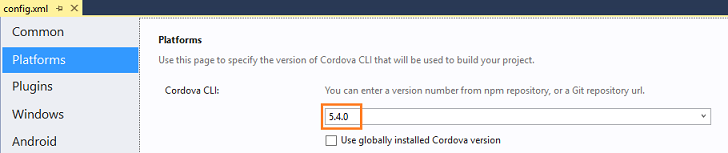
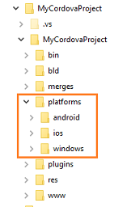
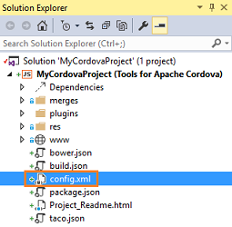
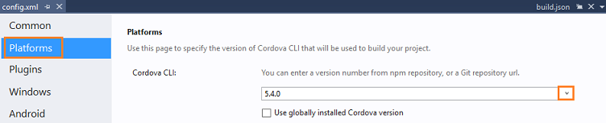

<properties
   pageTitle="Change the CLI version of your Visual Studio Tools for Apache Cordova project | Cordova"
   description="Change the CLI version of your Visual Studio Tools for Apache Cordova project"
   services="na"
   documentationCenter=""
   authors="normesta"
   tags=""/>
<tags
   ms.service="na"
   ms.devlang="javascript"
   ms.topic="article"
   ms.tgt_pltfrm="mobile-multiple"
   ms.workload="na"
   ms.date="12/03/2015"
   ms.author="normesta"/>

# Change the CLI version of your Visual Studio Tools for Apache Cordova project

>NOTE: This article aplies to Visual Studio 2015 Tools for Apache Cordova **Update 5**

You can update your project to use new versions of the Cordova Command-Line Interface (CLI).  New versions often include bug fixes and other improvements. However, they can also cause problems for plugins that have not been updated to that version.

This topic helps you decide whether to update the CLI version and how to do it safely.

## Find the CLI version number of your project

The CLI version number appears in the **Platforms** page of the configuration designer.



Or you can find it in the ```taco.json``` file at the root of your project.

When you create a project, Visual Studio uses the a specific version of the Cordova CLI but this version number becomes outdated over time. If you want to use a more recent version of the CLI, you have to make this change manually.

## Understand the impact on plugins

Plugins are tested against a specific version of each Cordova platform. For example, to ensure that a plugin works on an Android mobile device, the author validates the plugin against the *cordova-android 5.0.0* platform. In a sense, it's tied to that version of the Android platform.

The Apache Cordova CLI does something very similar. It's also tied or *pinned* to a specific version of each Cordova platform. When you first create a project, your CLI and the plugins that you add to your project are tied to the same versions.

If you update your CLI, it's tied to a newer version of each Cordova platform while your plugins remain tied to a previous version of each Cordova platform.

This isn't always a problem, but if a new version introduces a breaking change, you might encounter errors when you build your project or attempt to run code that uses the plugin.

You might encounter the opposite problem if you don't update the CLI version of your project. Plugins that already exist in your project work fine, but any new plugin that you add to your project (since VS will use the newer version) might be tied to newer version of each Cordova platform, making your app to does not work as expected.  

Have a quick look at this table. It presents each action, its impact, and what you can do to increase the likelihood that your plugins will work properly.

> **Note**: This table uses the term *existing* to refer to plugins that exist in your project when you decide to update your project's CLI version and the term *new* to refer to plugins that you add to your project after you update your project's CLI version.

<style>
    table, th, td {
        border: 1px solid black;
        border-collapse: collapse;
    }
    th, td {
        padding: 5px;
    }
</style>
<table>
    <thead>
        <tr>
            <th>Action</th>
            <th style="text-align:left">Impact on plugins</th>
            <th style="text-align:left">What you can do</th>
        </tr>
    </thead>
    <tbody>
        <tr>
            <td>Use the most recent version of the CLI</td>
            <td style="text-align:left">Existing plugins might not work as expected if they're tied to an older version of each Cordova platform.</td>
            <td style="text-align:left">Remove those plugins from your project.  Then, add the most recent version of those plugins to your project.</td>
        </tr>
        <tr>
            <td>Continue using the same version of the CLI</td>
            <td style="text-align:left">New plugins might not work as expected unless you explicitly add an older version of the plugin. </td>
            <td style="text-align:left">If no breaking changes were introduced in newer versions of each Cordova platform then plugins might work as expected.<br><br>If things don't quite work right in code that use those plugins, just add older versions of plugins to your project. </td>
        </tr>
        <tr>
            <td>Use an older version of the CLI</td>
            <td style="text-align:left">All plugins (new or existing) might not work as expected.<br><br></td>
            <td style="text-align:left">Remove existing plugins from your project and then add an older version of each plugin to your project.
            <br><br>If you want to add a new plugin, add older version of those plugins as well. </td>
        </tr>
    </tbody>
</table>

##How to add a plugin specific version

Current version of Visual Studio does not allows you to add a plugin specific version, and it will always add the latest one.

To install an specific version you have two different options
- Install from the cordova command line using the command ```cordova install plugin@verion --save```
- Modify the version in the config.xml file, delete the plugin folder, and build it again, so VS will download the appropiate version.   

## How to update the CLI version of your project

1. First, back up any file that you directly modified in the **platforms** folder of your project.    Visual studio will remove the **platform** folder and any file inside of it when you build your project.

    Most likely, you haven't made direct edits to this folder. Editing these files is an advanced task and you'd have to make those edits outside of Visual Studio.

    The following image shows this folder.

    

    If you didn't directly edit these files outside of Visual Studio, you can move to the next step.

2. In **Solution Explorer**, double-click the **config.xml** file to open the configuration designer.

    

3. In the configuration designer, choose the **Platforms** tab, and then, in the **Cordova CLI** drop-down list, choose the version of the Cordova CLI that you want to use.

    

4. In Visual Studio, choose **Build**->**Rebuild Solution**.

    This removes and then replaces all subfolders from the **Platform** folder of your project.

5. Add back any manual tweaks to files in platform subfolders.

6. Remove all plugins from your project and then add them back.

    To add and remove core plugins, see [Add or remove a plugin](./develop-apps/manage-plugins.md#Adding).

    To add and remove other third-party plugins, see [Add or remove a plugin that isn't present in the configuration designer](./develop-apps/manage-plugins.md#AddOther).

    >**Note**: If your using the most recent CLI version, then add the most recent version of each plugin. If you're using an older CLI version, then add an older versions of each plugin.
