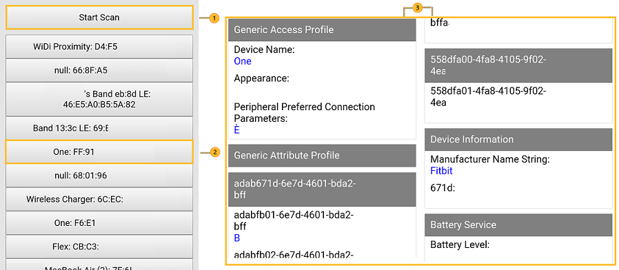
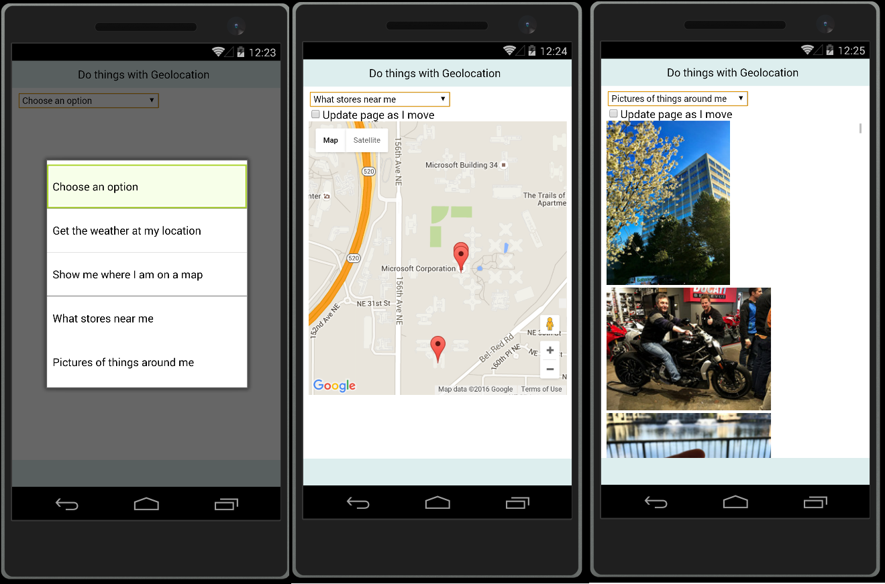
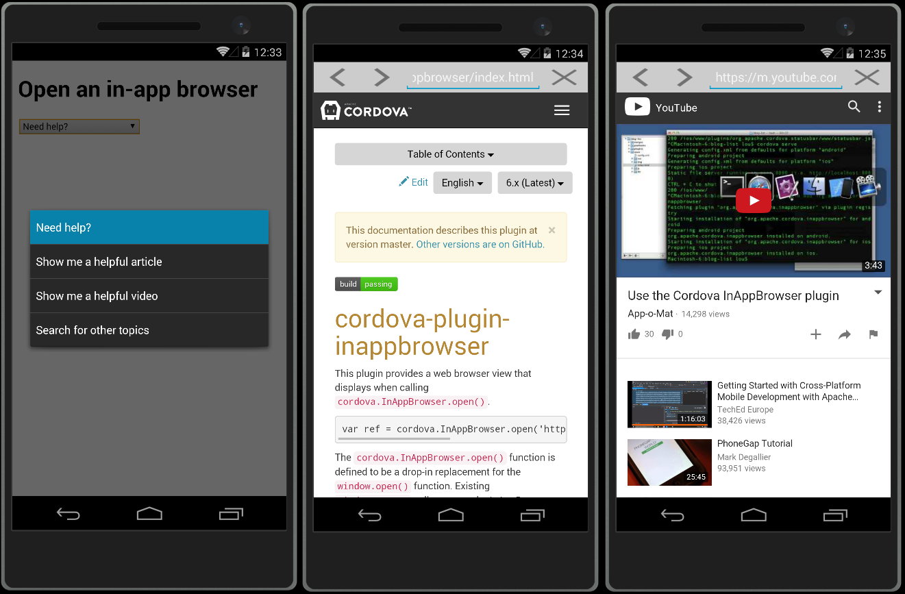
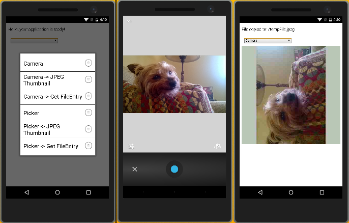
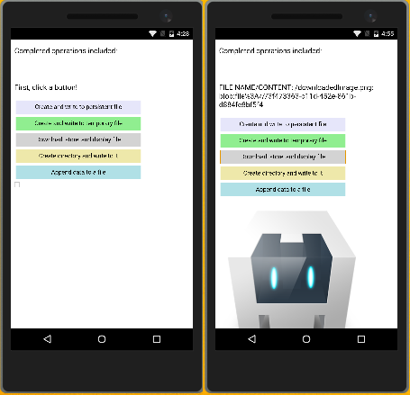
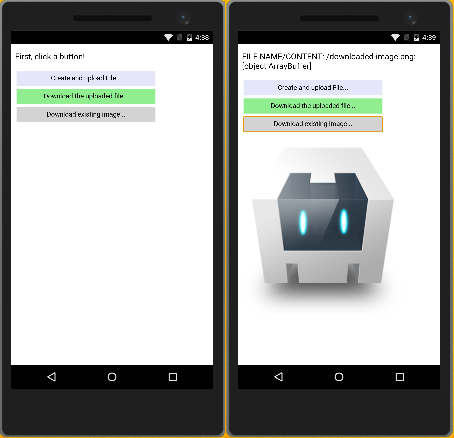

<properties
   pageTitle="Visual Studio Core Plugins | Cordova"
   description="Visual Studio Plugins"
   services="na"
   documentationCenter=""
   authors="normesta"
   tags=""/>
<tags
   ms.service="na"
   ms.devlang="javascript"
   ms.topic="article"
   ms.tgt_pltfrm="mobile-multiple"
   ms.workload="na"
   ms.date="05/03/2016"
   ms.author="normesta"/>

# Visual Studio Core Plugins

## Bluetooth LE : Discover and interact with devices

<button class="plugin-button-readme" onclick="window.location='https://www.npmjs.com/package/cordova-plugin-bluetoothle';">Readme</button>
<button class="plugin-button-guide" onclick="window.location='https://www.npmjs.com/package/cordova-plugin-bluetoothle#sample-discover-and-interact-with-bluetooth-le-devices';">Quick Guide</button>
 

Detect, connect, and interact with freeway monitors, cars, laptops, phones, TV set top-boxes and more. Notify users as they approach a restaurant that serves their favorite dish or a great promotion at a shop nearby.

Check out the [Quick Guide](https://www.npmjs.com/package/cordova-plugin-bluetoothle#sample-discover-and-interact-with-bluetooth-le-devices) and see how easy it is to discover devices, connect to a them, view device signal strength, supported services, battery level and more.

[ [Go back up](#top) ]

## Geolocation: Connect users with things around them

<button class="plugin-button-readme" onclick="window.location='https://cordova.apache.org/docs/en/latest/reference/cordova-plugin-geolocation/index.html';">Readme</button>
<button class="plugin-button-guide" onclick="window.location='https://cordova.apache.org/docs/en/latest/reference/cordova-plugin-geolocation/index.html#sample:-get-the-weather-find-stores-and-see-photos-of-things-nearby-with-geolocation';">Quick Guide</button>
 

Help users find things near them such as Groupon deals, houses for sale, movies playing, sports and entertainment events and more.

Check out the [Quick Guide](https://github.com/normesta/cordova-plugin-geolocation/blob/master/README.md#sample-get-the-weather-find-stores-and-see-photos-of-things-nearby-with-geolocation) for a cookbook of tasks. You'll get the weather, find your location on a map, see shops nearby, and look at pictures of things around you.

[ [Go back up](#top) ]

## InAppBrowser: Show web pages and videos within your app

<button class="plugin-button-readme" onclick="window.location='https://www.npmjs.com/package/cordova-plugin-inappbrowser';">Readme</button>
<button class="plugin-button-guide" onclick="window.location='https://github.com/normesta/cordova-plugin-inappbrowser/blob/master/README.md#sample-show-help-pages-with-an-inappbrowser';">Quick Guide</button>
 

Show helpful articles, videos, and web resources inside of your app. Users view documents without leaving your app.    

Check out the [Quick Guide](https://github.com/normesta/cordova-plugin-inappbrowser/blob/master/README.md#sample-show-help-pages-with-an-inappbrowser) to show an article, a video, and a search page. You'll even handle errors, and inject a custom script and style.

[ [Go back up](#top) ]

## Camera: Use the device's Camera or file picker in your app

<button class="plugin-button-readme" onclick="window.location='https://cordova.apache.org/docs/en/latest/reference/cordova-plugin-camera/index.html';">Readme</button>
<button class="plugin-button-guide" onclick="window.location='https://cordova.apache.org/docs/en/latest/reference/cordova-plugin-camera/index.html#sample">Quick Guide</button>
 

Take pictures, allow the user to choose a file on the device, get thumbnails, and display the pictures or images in your app.

Check out the [Quick Guide](https://github.com/apache/cordova-plugin-camera#sample) to learn how use the Camera app and file picker.

[ [Go back up](#top) ]

## File: Create and manipulate files and directories on your device

<button class="plugin-button-readme" onclick="window.location='https://www.npmjs.com/package/cordova-plugin-file';">Readme</button>
<button class="plugin-button-guide" onclick="window.location='https://github.com/apache/cordova-plugin-file#sample';">Quick Guide</button>
 

Create, read, write to, and display files on your device. Create directories. Work with different file types such as text files and binary files.

Check out the [Quick Guide](https://github.com/apache/cordova-plugin-file#sample) to learn how to work with files on your device.

[ [Go back up](#top) ]

## File Transfer: Upload and download files to and from your device

<button class="plugin-button-readme" onclick="window.location='https://www.npmjs.com/package/cordova-plugin-file-transfer';">Readme</button>
<button class="plugin-button-guide" onclick="window.location='https://github.com/apache/cordova-plugin-file-transfer#sample';">Quick Guide</button>
 

Upload and download different file types such as text files and binary files, read the files, and display image files.

Check out the [Quick Guide](https://github.com/apache/cordova-plugin-file-transfer#sample) to learn how to upload and download files.

[ [Go back up](#top) ]

## Network Information: Respond to network status changes

<button class="plugin-button-readme" onclick="window.location='https://cordova.apache.org/docs/en/latest/reference/cordova-plugin-network-information/index.html';">Readme</button>
 

[ [Go back up](#top) ]

## Vibration: Make the users phone vibrate

<button class="plugin-button-readme" onclick="window.location='https://cordova.apache.org/docs/en/latest/reference/cordova-plugin-vibration/index.html';">Readme</button>
 

[ [Go back up](#top) ]

## Battery status: Monitor the available power of a device

<button class="plugin-button-readme" onclick="window.location='https://www.npmjs.com/package/cordova-plugin-geolocation';">Readme</button>
 

Handle events that are raised when the user battery charge percentage changes or when they plug or unplug their phone from a power outlet.

[ [Go back up](#top) ]

## Dialogs: Notify users or prompt them to make a decision

<button class="plugin-button-readme" onclick="window.location='https://www.npmjs.com/package/cordova-plugin-geolocation';">Readme</button>
 

Show dialog boxes that give users information or ask them to make a decision.

[ [Go back up](#top) ]

## Console: Get reliable console output

<button class="plugin-button-readme" onclick="window.location='https://www.npmjs.com/package/cordova-plugin-geolocation';">Readme</button>
 

[ [Go back up](#top) ]

## Device: Get information about the user's device

<button class="plugin-button-readme" onclick="window.location='https://www.npmjs.com/package/cordova-plugin-geolocation';">Readme</button>
 

Get the model, platform, uuid, version, manufacturer, and serial number of the user's device.

[ [Go back up](#top) ]

## Whitelist: Restrict your app's access to external domains

<button class="plugin-button-readme" onclick="window.location='https://www.npmjs.com/package/cordova-plugin-geolocation';">Readme</button>
 

[ [Go back up](#top) ]

