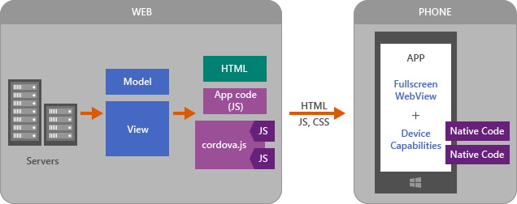
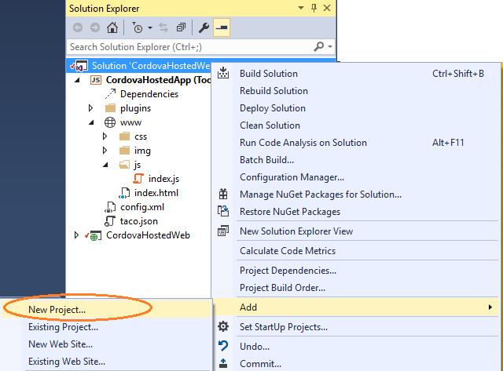
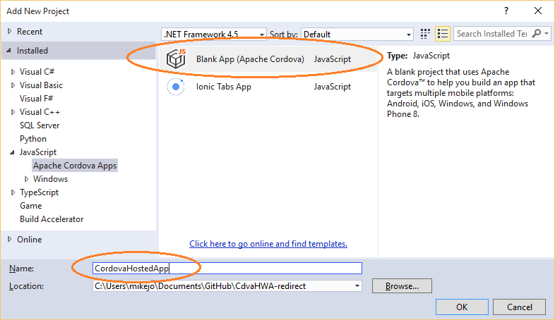
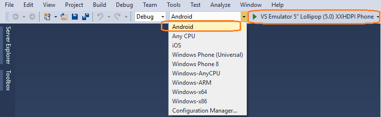
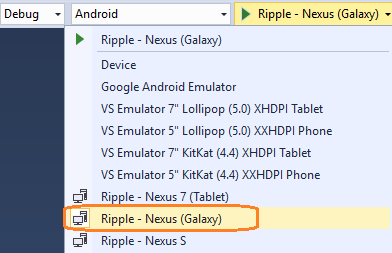
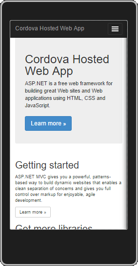
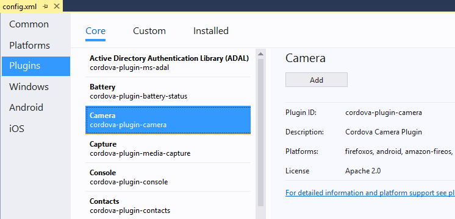

<properties
   pageTitle="Create a Hosted App | Cordova"
   description="description"
   services="na"
   documentationCenter=""
   authors="Mikejo5000"
   tags=""/>
<tags
   ms.service="na"
   ms.devlang="javascript"
   ms.topic="article"
   ms.tgt_pltfrm="mobile-multiple"
   ms.workload="na"
   ms.date="09/10/2015"
   ms.author="mikejo"/>

# Create a hosted app using Apache Cordova

Web developers can use Cordova to leverage existing web assets, get a web-based app uploaded to an app store, and get access to device features like the camera. In this topic, we want to show you a fast way to turn a Web site into a mobile app using Apache Cordova.

In general, when migrating a Web site, several approaches will work. Here are a few of them.

* Create a hosted app.

    For this scenario, you use a thin Cordova client (think of it as a web browser embedded in a native app) that automatically redirects to your Web site. For sites using ASP.NET and other server-side technologies, this is the fastest way to get up and running, and is a good way to get your app into one of the app stores quickly while learning Cordova. The full app experience will require an Internet connection, but you can also do a few things to handle offline scenarios. This approach will be much more effective if your Web site uses [responsive design](http://alistapart.com/article/responsive-web-design) techniques to adjust layout to match the device screen size.

    One advantage of using a hosted app is that you can make changes to the app on your server, and you only need to republish to the app store if you have changes to your device plugins.

* Move your front end code (or your View) from your Web site to a new Cordova app.

    This can be a good option especially if your web site does not implement server-side technologies such as ASP.NET, PHP, and Ruby, which are not supported on Cordova. For this option, your front end code must be repackaged in a Cordova-friendly fashion (plain HTML5, CSS, and JavaScript, with JSON for communication with your back-end server) so that it can run in the Cordova client (the native WebView). The actual steps involved are pretty specific to each Web site, so we will not be looking at this option in this article. For other resources and options, see [What's Next?](#next).

In this tutorial, we will get you started with Cordova by building a hosted app from an ASP.NET Web site. This mobile client app works on Android, iOS, and Windows 10.

Here is a quick look at the architecture of a hosted app showing the server on the left and the Cordova client app on the right. cordova.js gives access to the device APIs (Cordova plugins). In this architecture, you can code against device APIs in the app code on the server, using generic JavaScript plugin interfaces, which call native code that runs on the device.



## Get set up

1. If you haven't already, [Install Visual Studio 2015](http://go.microsoft.com/fwlink/?LinkID=533794) with Visual Studio Tools for Apache Cordova.

    > **Important**: When you install Visual Studio, make sure you include the optional components, **HTML/JavaScript (Apache Cordova)** under Cross-Platform Mobile Development.

2. Download the starter ASP.NET solution that you will use to create the hosted app.

    To perform the steps in the tutorial, [get the starter solution here](https://github.com/Mikejo5000/CdvaHWA-starter). Download it and unzip. We will use this sample to show you how to create a hosted app.

    If you don't want to perform the actual steps, but just want to run the finished sample app, get the completed sample [here](https://github.com/ridomin/CdvaHWA). You can read through the steps to find out more about the code, but the steps will be finished already.

3. Extract the downloaded files.

4. Open the starter solution (.sln file) in Visual Studio. (Make sure you select the unzipped file!)

## Add a Cordova project to the solution

The starter solution includes an ASP.NET MVC site (the CordovaHostedWeb project) that you will use in the hosted app. You will add a Cordova client app to this solution and call it CordovaHostedApp.

1. In Visual Studio's Solution Explorer, right-click the solution and choose **Add**, **New Project**. (Make sure you right-click the solution and not the CordovaHostedWeb project!)

    

2. In the New Project dialog box, choose **JavaScript**, then **Apache Cordova Apps**, and select **Blank App (Apache Cordova)**.

    

3. For the project name, type "CordovaHostedApp", or something similar, and choose **OK**.

    Visual Studio creates the Cordova mobile app project and adds it to the starter solution. The project appears in Solution Explorer.

3. In Solution Explorer, right-click the new Cordova project and choose **Set as Startup Project**.

4. Identify one or more emulators for initial testing of the Hosted App sample based on your dev environment.

    * If you are running Windows 10 on a machine that supports [Hyper-V](https://msdn.microsoft.com/en-us/library/mt228280.aspx), we recommend testing against the Visual Studio Emulator for Android. This is a fast, full-featured emulator. (Running on a VM is not supported.)

    * If you are running Windows 10, you can also run against Windows Phone 10 emulator or your Windows 10 device. If your device has a webcam, you can use it later in the tutorial!

    * If you are running Windows 7 or later, run against the Ripple Simulator (install Chrome now if you don't have it). For the final section in this tutorial, you will need to configure a [full-featured emulator](http://taco.visualstudio.com/en-us/docs/run-app-apache/), such as the Google Android Emulator or GenyMotion, or you can run against an actual device. (Ripple does not support the Camera plugin.)

    > **Note**: You can run the app on iOS, but setup requires additional steps and either a Mac or cloud-based Mac service. See [Install Tools for iOS](http://taco.visualstudio.com/en-us/docs/install-vs-tools-apache-cordova/#ios).

5. Now, select a preferred emulator in Visual Studio.

     Choose a platform to run against from the Solution Platforms list in the debug toolbar. If you are running on Windows 10, choose **Windows - Any CPU** as the target, and then choose **Local Machine** from the device list on the right.

     If you can run on the VS Emulator for Android on Windows 10, choose **Android**, then **VS Emulator 5" Lollipop (5.0) XXHDPI Phone**.

    

    If you are running initially on Ripple, choose **Android,** then **Ripple - Nexus (Galaxy)**. See the illustration below.

      

7. Press F5 to start the app.

     When the app loads, it displays a "Hello, your application is ready" message.

     The app that loads at this point is a standard Cordova app running in a native WebView.

8. Press Shift + F5 to stop debugging.

## Change the Cordova project to a hosted app

1. In Solution Explorer, right-click config.xml in the CordovaHostedApp project and choose **View Code**.

2. Add the following entry after the first set of `<allow-intent.../>` tags (before the `<platform>` sections).

    ```
    <allow-navigation href="https://cordovahostedweb-starter.azurewebsites.net" />
    ```

    This entry in config.xml will enable navigation to the hosted site.

    > **Note**: When you republish later, make sure the domain name you use in `<allow-navigation>` matches the domain URL!

3. If you will be testing on Windows 10, right-click config.xml in Solution Explorer and choose **View Designer**.

    Choose Windows 10 in the **Windows Target Version**.

2. Open index.js in the www\scripts folder and replace all the default code with the following code.

    ```
    var app = {
        // Application Constructor
        initialize: function() {
        this.bindEvents();
        },
        bindEvents: function() {
            document.addEventListener('deviceready', this.onDeviceReady, false);
        },
        onDeviceReady: function() {
            app.receivedEvent('deviceready');

            // Here, we redirect to the web site.
            var targetUrl = "https://cordovahostedweb-starter.azurewebsites.net/";
            var bkpLink = document.getElementById("bkpLink");
            bkpLink.setAttribute("href", targetUrl);
            bkpLink.text = targetUrl;
            window.location.replace(targetUrl);
    },
        // Note: This code is taken from the Cordova CLI template.
        receivedEvent: function(id) {
            var parentElement = document.getElementById(id);
            var listeningElement = parentElement.querySelector('.listening');
            var receivedElement = parentElement.querySelector('.received');

            listeningElement.setAttribute('style', 'display:none;');
            receivedElement.setAttribute('style', 'display:block;');

            console.log('Received Event: ' + id);
        }
    };

    app.initialize();
    ```
    The preceding code sets the URL of the native WebView window (using window.location.replace) when Cordova's [deviceReady](https://cordova.apache.org/docs/en/latest/cordova/events/events.html) event fires. In the deviceReady handler, you set the URL to the web site URL.

    We also removed the [pause and resume](https://cordova.apache.org/docs/en/latest/cordova/events/events.html) event code. We will add this code later to the CordovaHostedWeb project so the event handlers run on the web site.

    Most of the remaining code here is from the Cordova CLI blank template, and you don't need to worry about it right now.

3. Open index.html and replace all the HTML in the `<body>` element with the following HTML.

    ```
    Verifying connectivity..
    <a id="bkpLink" href="https://cordovahostedweb-starter.azurewebsites.net">cordovahostedweb.azurewebsites.net</a>

    <div class="app">
        <h1>Apache Cordova</h1>
        <div id="deviceready" class="blink">
            <p class="event listening">Connecting to Device</p>
            <p class="event received">Device is Ready</p>
        </div>
    </div>
    <script type="text/javascript" src="cordova.js"></script>
    <script type="text/javascript" src="scripts/index.js"></script>
    ```

    The most important thing here is that you create the anchor link that is used in the redirect script you created in the previous step.

4. In index.html, replace the default [Content-Security-Policy](http://taco.visualstudio.com/en-us/docs/cordova-5-security/#the-w3c-content-security-policy-csp) (CSP) `<meta>` element with the following `<meta>` element.

    ```
    <meta http-equiv="Content-Security-Policy" content="default-src 'self' data: gap: https://cordovahostedweb-starter.azurewebsites.net https://ssl.gstatic.com 'unsafe-eval'; style-src 'self' 'unsafe-inline'; media-src *">
    ```

    By adding the web site URL to the default CSP (https://cordovahostedweb-starter.azurewebsites.net in this example), you specify that it is a trusted domain, and content from this site will be allowed in your hosted app.

5. Add additional `<meta>` elements that we are borrowing from another Cordova template.

    ```
    <meta name="format-detection" content="telephone=no">
    <meta name="msapplication-tap-highlight" content="no">
    <meta name="viewport" content="user-scalable=no, initial-scale=1, maximum-scale=1, minimum-scale=1, width=device-width">
    ```
    These elements provide viewport attributes and a few other features.

6. Press F5 to start the app.

    When the emulator starts, you will see the hosted app load!

    

    If everything looks good, you already have your hosted app working! Congratulations on a great start! However, you need to do a few more things to enable support for device plugins.

8. Before moving on, if you can run the app on other emulators at this stage, try that, too.

    Here is what the app looks like running on Windows 10.

    

## Provide a mobile-specific page for the web site

Now, you will update the web site to display a mobile-specific page if the site detects a Cordova app. In this app, you will add this code so that users running the Cordova hosted app can access device features such as the camera, while visitors using a browser will get the default home page.

1. Open index.js in the CordovaHostedApp project and update the targetUrl variable.

    This line of code should look like this now.

    ```
    var targetUrl = "https://cordovahostedweb-redirect.azurewebsites.net/cordova/setPlatformCookie?platform=" + cordova.platformId;
    ```

    Now, when the Cordova app redirects to the web site, the apps call a function (setPlatformCookie) to tell the web site that a Cordova app is running. You also pass in the Cordova platform ID. You will need this for redirection.

    > **Note**: To save steps later, we’re using a new URL: https://cordovahostedweb-redirect.azurewebsites.net

2. In the CordovaHostedWeb (ASP.NET) project, right-click the Controllers folder and choose **Add**, **Existing item**, go to the Controllers folder, and add the file called cordovaController.cs to the project.

    This file contains the following code.

    ```
    using System;
    using System.Collections.Generic;
    using System.Linq;
    using System.Web;
    using System.Web.Mvc;

    namespace CordovaHostedWeb.Controllers
    {
        public class CordovaController : Controller
        {
            const string platformCookieKey = "cdva_platfrm";
            public ActionResult Index()
            {
                var cookie = HttpContext.Request.Cookies[platformCookieKey];
                var platform = "dontknow";
                if (cookie!=null)
                {
                    platform = cookie.Value;
                }
                ViewBag.Platform = platform;
                return View();
            }
            public ActionResult setPlatformCookie(string platform)
            {
                if (!string.IsNullOrWhiteSpace(platform))
                {
                    HttpContext.Response.SetCookie(new HttpCookie(platformCookieKey, platform));
                }
                return RedirectToAction("index");
            }
        }
    }
    ```

    This code redirects the site to the Cordova-specific Index.cshtml when the client app passes a querystring that includes the setPlatformCookie function call along with the platform ID. You already specified this URL in the client app's redirect script (index.js).

5. In the CordovaHostedWeb (ASP.NET) project, right-click the Views/Cordova folder and choose **Add**, **Existing item**, go to the Views/Cordova folder, and add the file called Index.cshtml to the project.

    This page contains the following code.

    ```    
    @{
        ViewBag.Title = "index";
        var platform = ViewBag.Platform;
    }

    <h2>index</h2>

    @section Metas{
        <meta http-equiv="Content-Security-Policy" content="default-src 'self' data: gap: https://cordovahostedweb-redirect.azurewebsites.net/ https://ssl.gstatic.com 'unsafe-eval'; style-src 'self' 'unsafe-inline'; media-src *">
    }

    @if (platform == "android" || platform == "ios" || platform == "windows")
    {
        @Scripts.Render("~/cordovadist/" + platform + "/cordova.js");

        <p><a class="btn btn-primary btn-lg">Learn more &raquo;</a></p>
        

        @Scripts.Render("~/cordovaApp/app.js");
    }
    else
    {
        <p>No valid platform found</p>
    }

    <div>
        Found cookie platform to be: <strong>@platform</strong>
    </div>
    ```

    This page is a mobile-specific page that renders when a Cordova app connects with a valid platform ID (Android, iOS, or Windows). This code includes the same CSP `<meta>` element as the client app, which means the client app can show content from the web site.

    This page also loads a platform-specific version of cordova.js, which enables the use of Cordova plugins for device access. When you finish these steps, your app will be able to access device features on Android, iOS, and Windows. You will use device features (Camera) later in this tutorial.

    Finally, this page also loads the app.js script. You will use this file later to add the server-side Camera plugin code. This code calls native code that runs on the device. (You don't need to worry about that yet.)

## Connect to the hosted app from your device.

To save time and steps, instead of republishing the ASP.NET project to a new Azure Web App URL, you will connect to a version of the project with the changes already in place. (If you want info on how to republish to a new URL, see the Appendix in this article.)

1. Update the URL references in both projects to point to the new site. Specifically, update these references:

    In the CordovaHostedApp project:
    * In config.xml, update the `<allow-navigation>` element with the new URL:
        https://cordovahostedweb-redirect.azurewebsites.net/
    * In index.html, update the CSP `<meta>` element with the same URL.
    * In index.js, you already modified the targetURL variable with the new URL, but you can verify that it's correct. It should look like this:

        ```
        var targetUrl = "https://cordovahostedweb-redirect.azurewebsites.net/cordova/setPlatformCookie?platform=" + cordova.platformId;
        ```

    In the CordovaHostedWeb project:

    * In Views/Cordova/index.cshtml, you already modified the CSP `<meta>` element with the new URL, so you don’t need to change it.

4. Press F5.

    This time, when the hosted app loads on your device or emulator, the Cordova-specific page will load.

    

    > **Note**: On Ripple, the redirection is only partially supported. If you see an error message, close the message to see the redirection page of the hosted app.

    Next, you want to fix up this page so that you can access the device camera and take a picture.

## Add plugins to your project

Cordova plugins will give you device access to things like the camera and file system. In this tutorial, you are using the Camera plugin. The exact same methods apply to using other plugins in a hosted app.

1. In Solution Explorer, open config.xml and choose the Plugins tab.

2. Select the **Camera** plugin and choose **Add**.

    

    Visual Studio adds this plugin to your solution. You will use this plugin later when adding device capabilities.

3. Select the **Whitelist** plugin and choose **Add**.

    The plugin is already present in the Blank App template, but you want the Visual Studio configuration designer to see it.

## Take a quick look at the plugin files in the ASP.NET project.

For the web site to run plugin code, cordova.js and the JavaScript plugin code need to be copied from the CordovaHostedApp project to the CordovaHostedWeb project. To save steps in this tutorial, we already copied the plugin files over. Take a look at the files under the cordovadist folder in CordovaHostedWeb.


You can find these files in the \platforms folder after building your CordovaHostedApp project for a particular platform like Android. For example, the Android files are in \platforms\android\assets\www.

The CordovaHostedWeb project uses ImportCordovaAssets.proj to automatically copy these files from the CordovaHostedApp project into the CordovaHostedWeb project. You can use the .proj file in your own hosted app, but we won't be looking at it now.

## Configure the Web site to run the Camera plugin code

The starter ASP.NET project (CordovHostedWeb) already has the plugin code. Now, you can add some code to actually use the Camera app on the device. You will add plugin code to app.ts in the CordovaHostedWeb project.

1. In the CordovaHostedWeb project, open Views/Cordova/Index.cshtml.

2. Find the `btn-lrg` <anchor> element and change the display text to **Take Picture**.

    When updated, this line of HTML should look like this:

    `<p><a class="btn btn-primary btn-lg">Take Picture &raquo;</a></p>`

3. In the cordovaApp folder (which contains app code), open app.ts and add an event handler for the button's click event in the onDeviceReady function.

    The updated function looks like this:

    ```
    function onDeviceReady() {
        // Handle the Cordova pause and resume events
        document.addEventListener('pause', onPause, false);
        document.addEventListener('resume', onResume, false);

        document.getElementsByClassName('btn-lg')[0].addEventListener('click', takePicture);

    }
    ```

4. In app.ts, add the following function in the same scope as the onDeviceReady function (make it one of the Application module exports).

    ```
    function takePicture() {
        if (!navigator.camera) {
            alert("Camera API not supported");
            return;
        }
        var options = {
            quality: 20,
            destinationType: Camera.DestinationType.DATA_URL,
            sourceType: 1,      
            encodingType: 0     
        };

        navigator.camera.getPicture(
            function (imgData) {
                var el : HTMLElement;
                el = <HTMLElement>document.getElementsByClassName('media-object')[0];
                var srcAttr = document.createAttribute("src");
                srcAttr.value = "data:image/jpeg;base64," + imgData;
                el.attributes.setNamedItem(srcAttr);                    
            },
            function () {
                alert('Error taking picture');
            },
            options);

        return false;
    }
    ```

    This code adds an event handler for the **Take Picture** picture button that you just modified in Index.cshtml. When you press the button, the app calls takePicture, which will run the Camera app using the Camera plugin.

    >**Note**: app.ts will compile to app.js when you build.

## Connect to the hosted app with the working Camera code from your device

To save time and steps, instead of republishing the CordovaHostedWeb project to a new Azure Web App URL, you will connect to the final version of the project with Camera support already in place. (If you want info on how to republish to a new URL, see the Appendix at the end of this article.)

1. Update the URL references in both projects to point to the new site. Specifically, update these references:

    In the CordovaHostedApp project:
    * In config.xml, update the `<allow-navigation>` element with the new URL:
        https://cordovahostedweb.azurewebsites.net/
    * In index.html, update the CSP `<meta>` element with the same URL.
    * In index.js, update the targetURL variable with the new URL. Verify that you are using the correct value for the targetUrl. It should look like this:

        ```
        var targetUrl = "https://cordovahostedweb.azurewebsites.net/cordova/setPlatformCookie?platform=" + cordova.platformId;
        ```

    In the CordovaHostedWeb project:

    * In Views/Cordova/index.cshtml, update the CSP <meta> element with the new URL.

2. Choose your preferred emulator to run the app.

    > **Note**: Ripple doesn't support the Camera plugin, so you can't run successfully on Ripple at this point. To see the Camera in action, [upgrade to a full-featured emulator](http://taco.visualstudio.com/en-us/docs/run-app-apache/), such as the VS Emulator for Android, the Google Android Emulator, GenyMotion, or you can run against an actual device.

3. Press F5 to run the app.

4. When the app loads, press the **Take Picture** button.

    

    When you press the button, the Camera app (or simulation) loads in the hosted web app.

    

    You can click the round button at the bottom to take a picture on the device (Android shown).

## What's Next? <a id="next" />

You may want to investigate options to find an approach that works best for you. Maybe a Hosted App design will help you get an app into the app store quickly, but you may decide to go another route as well. Here are some options for moving forward.

* **Make your Hosted App Better**

    * Add splash screens and icons. Take a look at the [cordova-imaging](https://www.npmjs.com/package/cordova-imaging) plugin for this.

    * Make you Web site more [responsive](http://alistapart.com/article/responsive-web-design). You can build native-like features into your Web UI such as pull-to-refresh using frameworks such as [Ionic](http://ionicframework.com/).

    * Add offline support:
        * For caching pages, implement a [service worker](https://www.npmjs.com/package/cordova-plugin-service-worker) (iOS plugin) or use HTML5 [AppCache](http://stackoverflow.com/questions/15870163/html5-android-phonegap-web-app-not-working-offline-with-cache-manifest). (With AppCache, it can be a challenge to debug the required manifest.)
        * For [offline data](http://cordova.apache.org/docs/en/latest/cordova/storage/storage.html) in Cordova, use local storage, IndexedDB, or WebSQL (WebSQL is a deprecated standard).

    * Take a look at [Manifold.js](http://manifoldjs.com/). You give it a Web site URL, and it gives you a hosted mobile app. (At present, the resulting project is not compatible with the Cordova CLI, nor with Cordova-dependent tools like Visual Studio Tools for Apache Cordova.)

* **Create a Cordova app by refactoring the front end code on your Web site**

    * If your Web site doesn't use dynamically generated HTML, you may be able to take this approach to get up and running fairly quickly.

    * In a Cordova project, use plain HTML5, CSS, and JavaScript for your UI, along with xhr requests and JSON for calling your back-end. You may also choose to improve your app by using a mobile-optimized JavaScript framework such as [Ionic](http://ionicframework.com/) or [bootstrap](http://getbootstrap.com/). Or you can use a framework like JQuery.

* **Create a fully packaged app by migrating your Web site to Cordova**

    * Similar to the refactoring option, but you move the site's code into Cordova as a fully packaged app. If you call a web service in your app, use xhr and JSON. Doing this work may or may not be easy depending on whether your site used a lot of server-side technologies.

* **Explore other architectures that may be used for hosted apps**

    * The [Application Shell Architecture](https://medium.com/google-developers/instant-loading-web-apps-with-an-application-shell-architecture-7c0c2f10c73#.ogxsvl7wr) may be one way to enable good offline support and high performance in a hosted app.

## Appendix: Publish the Web site

This section includes information on how to republish the CordovaHostedWeb ASP.NET project instead of using the pre-existing Azure Web App URLs that are used in the tutorial. You don't need these steps unless you want to connect to your own implementation of the CordovaHostedWeb project.

1. Choose **Build**, then **Build Solution**.

2. In Solution Explorer, right-click the ASP.NET project (CordovaHostedWeb) and choose **Publish**.

    

3. In the Publish Web dialog box, choose **Microsoft Azure Web Apps**.

    

    Visual Studio opens the Azure Web App Settings page. For this tutorial, the Azure settings aren't important, but by completing the dialog box, you can use the **Publish** feature in VS for Web sites.

5. In the Configure Microsoft Azure Web App dialog box, enter your Microsoft Account credentials if you are asked for them.

    

6. Click **New**.

    You will use new settings for the web site because that way you can make updates to the site and publish to a new URL.

    

    Use unique values like **Hosted-App-yourusername** and **Hosted-App-svc-yourusername**.

    When you click OK, Visual Studio creates the solution and the new Web App. (Don't worry about any Azure error messages at this point...)

5. In the Publish Web dialog box, change the URL from http:// to https:// .

    The change to SSL is for iOS support (which you won't test right now, since it involves additional steps).

4. In the Publish Web dialog box, copy the **Destination URL** to the clipboard, and then choose **Publish**.

    

    The ASP.NET MVC web site will open in your browser.

    To connect to the republished site from your cient app, you will first need to update the CordovaHostedApp project with the copied URL. See earlier tasks to do this.

    You will also need to updated the CSP `<meta>` element in the CordovaHostedWeb project with the new URL and republish.
