<properties
   pageTitle="Get started with Visual Studio Tools for Apache Cordova | Cordova"
   description="Get started with Visual Studio Tools for Apache Cordova"
   services="na"
   documentationCenter=""
   authors="normesta"
   tags=""/>
<tags
   ms.service="na"
   ms.devlang="javascript"
   ms.topic="article"
   ms.tgt_pltfrm="mobile-multiple"
   ms.workload="na"
   ms.date="02/28/2016"
   ms.author="normesta"/>

# Get started with Visual Studio Tools for Apache Cordova

You can use Visual Studio Tools for Apache Cordova to build apps that run on iOS, Android, and Windows devices and share nearly 100% of your code ([learn more](https://www.visualstudio.com/explore/cordova-vs)).

In this guide, we'll give you a tour of what you can do with these tools. Along the way, you'll build a basic app that looks like this.

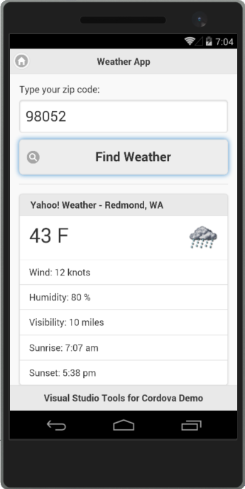

You can find the complete sample [here](https://github.com/Microsoft/cordova-samples/tree/master/weather-app).

It's not much, but when you're done, this process won't seem so mysterious. In fact, it's fun and relatively simple. Where you take things from there is up to you and your imagination.

Before we begin, make sure that you have the tools installed. See [install Visual Studio Tools for Apache Cordova](install-vs-tools-apache-cordova.md).

If you're ready to go, let's start.

## <a id="get-started"></a>First, create a project

1.	In Visual Studio, create a new **Blank App** project and name it *WeatherApp* (*You can find it under **JavaScript**->**Apache Cordova Apps** in the **New Project** dialog box*).

    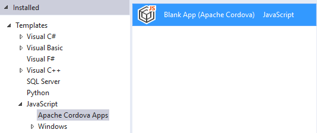

    > **Note:** If you like TypeScript, there's a template for that under **TypeScript**->**Apache Cordova Apps**.

    After you create the project, your solution should resemble the following:

    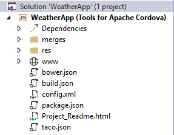

## <a id="tour-project"></a>Quick tour of the project

There's a lot of files in your project so don't worry too much about understanding them all right away. You can peruse this section to get a sense for what each one does. Over time, you'll naturally incorporate more of these files into your workflow.

### The configuration files of your project

You'll find these files in the root of your project.

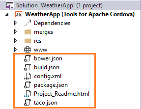

This table gives you the basic idea of how you might use each one.
<style>
    table, th, td {
        border: 1px solid black;
        border-collapse: collapse;
    }
    th, td {
        padding: 5px;
    }
</style>
<table>
<tbody><tr>
  <th>
    <p><strong>File</strong></p>
  </th>
  <th>
    <p><strong>Why is it in your project?</strong></p>
  </th>
</tr>
 <tr>
   <td><strong>bower.json</strong></td><td>This file manages the <a href="http://bower.io//">Bower</a> packages dependencies of your app. <br><br>Bower is a package manager. We won't use it in this guide, but you can learn more about it <a href="https://taco.visualstudio.com/en-us/docs/tutorial-using-bower/">here</a>.</td>
 </tr>
 <tr>
   <td><strong>build.json</strong></td><td>This file contains parameters that Visual Studio uses to build a signed Android package. <br><br>We won't create one in this guide, but you can learn more about it <a href="https://taco.visualstudio.com/en-us/docs/tutorial-package-publish-readme/">here</a>.</td>
 </tr>
 <tr>
   <td><strong>config.xml</strong></td><td>Contains the settings of your app. <br><br>We'll change these settings later in this guide.</td>
 </tr>
 <tr>
   <td><strong>taco.json</strong></td><td>Defines which version of the <a href="https://cordova.apache.org/docs/en/4.0.0/guide/cli/">Cordova CLI</a> Visual Studio uses to build the project.</td>
 </tr>

</table>

### The folders of your project

#### www

This folder contains the HTML, JavaScript, style sheets, and images that you want to use in your app.

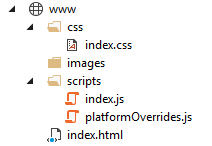

It already contains some files, so this app can be run right out of the box. You can modify these files or add more as you build your app.

#### merges

This folder contains the HTML, JavaScript, and style sheet files that apply to **specific platforms**.

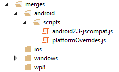

When you build your app, all files and folders in the merges/_platform_ are copied into the final folder structure, overwriting any files with the same names in the root project.

For example, the ```scripts/platformOverrides.js``` file is replaced by the ```merges/android/scripts/platformoverrides.js``` file on Android. This is how you can incorporate platform-specific code.

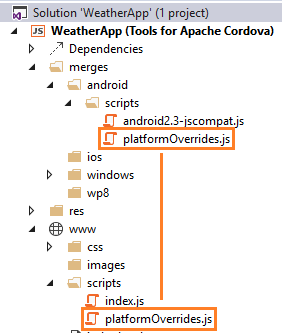

Use this same approach to merge CSS, images and anything else.

#### res

This folder contains icons, splash screens, signing certificates and any other platform-specific files.

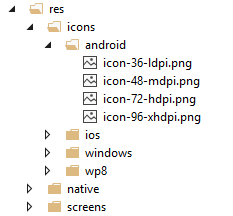

## <a id="run"></a>Run your app

1. On the Standard toolbar, choose the **Ripple – Nexus (Galaxy)** button.

    

    Your app opens in Apache Ripple and it looks like this because we haven't added any code yet.

    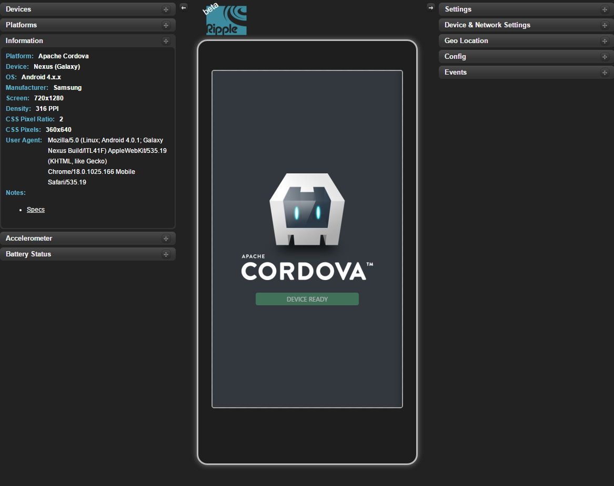

    [Apache Ripple](/articles/develop-apps/run-app-ripple-simulator.md) is a free mobile simulator. If you haven’t used it before, try a few things while you have it open. For example, change the device orientation or the platform and see how your app appears. Apache Ripple is probably the easiest way to see the effect of your changes as you develop.

    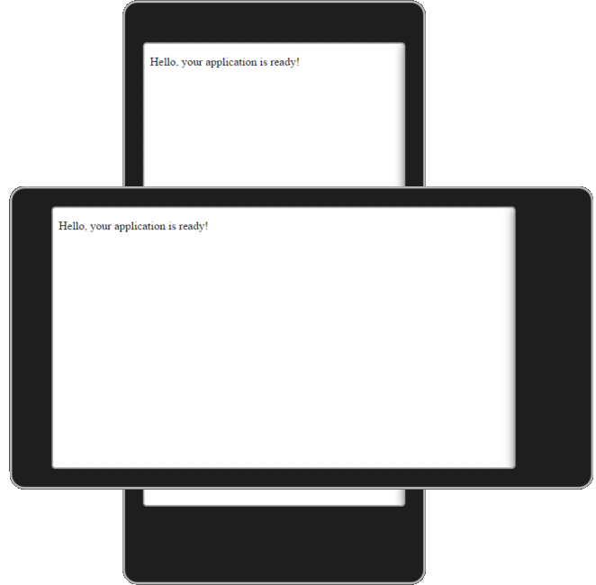

2. Stop the app. You'll find the button to stop it in the Standard Toolbar.

    

    You can also run your app in Android, iOS, and Windows device emulators. An emulator gives you a bit more of a realistic device experience.

    To see them all, choose any platform from the platform list on the Standard toolbar.

    

    Then, choose an emulator.

    

    Run your app in any of these emulators if you want, but don't use any of the iOS emulators yet because you need a Mac to use them, and setting up the connection between Visual Studio and the Mac is a little advanced for this guide.

    If you want to run your app on iOS, you can use the Ripple simulators. After you complete this guide, see [This article](ios-guide.md) for guidance on how to run your app in an iOS emulator or device.

## <a id="settings"></a>Find app settings

To give your app a name, increment the version number, and control other aspects of your app's behavior, modify the global configuration file, **config.xml**.

You can modify it by using a designer, so you don't need to edit the XML directly unless you want to.

To open the designer, double click the **config.xml** file in your project.


## <a id="build-something"></a>Start Small: Build a basic app

Apps can be as complicated or as simple as you want them to be. The goal of this section is to build a very basic single page app that shows the weather conditions of any area in the United States.

### Add packages

First, you'll add the [JQuery](https://jquery.com/) and [JQuery Mobile](https://jquerymobile.com/) NuGet packages to your project.

If you're not familiar with JQuery, it's just a JavaScript library that makes certain tasks easier such as changing the properties of a control or handling it's events, and that's exactly what we'll use it for.

JQuery Mobile is a touch-optimized HTML5 UI framework, built on JQuery core, designed to make responsive web sites and apps that are accessible on all smartphone, tablet and desktop devices. It'll give us a quick way to style the application without having to do custom CSS work.

1. Choose **Tools** -> **NuGet Package Manager** -> **Manage NuGet Packages for Solution**, and add the **jQuery** NuGet package to your solution.

    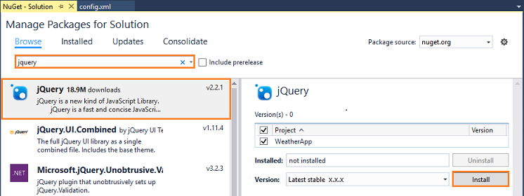

    >**Note**: Because versions constantly change, the next few images will use ```x.x.x``` in place of version numbers.

2. Add the **jQuery.Mobile** NuGet package to your solution.

    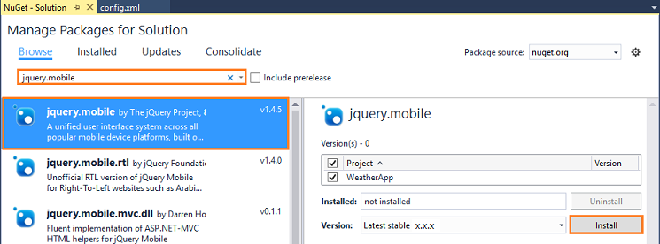

     NuGet adds files to the **Scripts** folder of your project, but that's not really where we need them so we'll have to fix that.

3. Drag those files to **scripts** subfolder of your **www** folder

    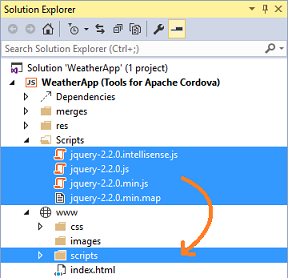

    Now they're in the correct location. But we still have a little work to do here. Nuget also adds CSS files to the **Content** folder so we'll have to fix that too.

4. Drag the CSS files to **css** subfolder of your **www** folder.

    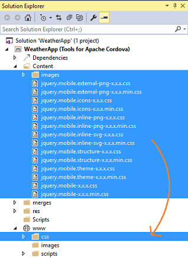    

3. Add this script reference to the `<body>` tag of your [index.html](#tour-project) file (at the bottom of the body section, where the other JavaScript references are located):

    ```html
    <script src="scripts/jquery-x.x.x.min.js"></script>
    <script src="scripts/jquery.mobile-x.x.x.min.js"></script>
    ```

    Replace the ```x.x.x``` in these filenames with the versions that you've downloaded. For example, if you downloaded jQuery version ```2.2.1```, and jQuery mobile version ```1.4.5```, your references would look like this:

    ```html
    <script src="scripts/jquery-2.2.1.min.js"></script>
    <script src="scripts/jquery.mobile-1.4.5.min.js"></script>
    ```

4.  Add this style reference to the `<head>` tag of your [index.html](#tour-project) file, above the existing **index.css** reference:

    ```html
    <link rel="stylesheet" href="css/jquery.mobile-x.x.x.min.css" />
    ```

    As you did in the previous example, replace ```x.x.x.``` with the version of JQuery mobile that you downloaded. If you downloaded jQuery mobile version ```1.4.5```, your reference would look like this:

    ```html
    <link rel="stylesheet" href="css/jquery.mobile-1.4.5.min.css" />
    ```

### Design a page

**index.html** is the first page that appears when users run your app. So we'll add our HTML to that file. Of course, this is the default setting and you can change that at any time in the [configuration designer](#settings).

1. Open the **index.css** file and replace its content with the following css rules:

    ```css
    .not-displayed {
        display: none;
    }

    form {
        border-bottom: 1px solid #ddd;
        padding-bottom: 5px;
    }

    #zip-code-input {
        font-size: 25px;
    }

    #get-weather-btn {
        font-size: 22px;
    }

    #title {
        font-size: 16px;
    }

    #summary {
        font-size: 35px;
    }

    #summary img {
        float: right;
    }

    #error-msg {
        text-align: center;
        margin-top:  50%;
        font-weight: bold;    
    }
    ```
1. Open the **index.html** file and remove this line.

    ```html
    <p>Hello, your application is ready!</p>
    ```

2. Add this HTML to the ```<body>``` of the page to give users a way to search for the weather and see the results.

    ```html
    <div data-role="page" id="weather-page">

        <div data-role="header" class="header">
            <h1 id="app-title">Weather App</h1>
            <a href="/" class="ui-btn ui-btn-left ui-btn-corner-all ui-icon-home ui-btn-icon-notext" rel="external">Home</a>
        </div>

        <div role="main" class="ui-content">
            <form>
                <label for="zip-code">Type your zip code:</label>
                <input id="zip-code-input" name="zip-code" placeholder="eg. 98001" required />
                <button id="get-weather-btn" data-role="button" data-icon="search">Find Weather</button>
            </form>

            <ul id="weather-data" data-role="listview" data-inset="true" class="ui-listview ui-listview-inset ui-corner-all ui-shadow not-displayed">
                <li data-role="list-divider" id="title" class="ui-li-divider ui-bar-a"></li>
                <li><span id="summary"><span id="temperature"></span> F </span></li>
                <li>Wind: <span id="wind"></span> knots</li>
                <li>Humidity: <span id="humidity"></span> %</li>
                <li>Visibility: <span id="visibility"></span> miles</li>
                <li>Sunrise: <span id="sunrise"></span></li>
                <li>Sunset: <span id="sunset"></span></li>
            </ul>

            <div id="error-msg" class="not-displayed">
            </div>

        </div>

        <footer data-role="footer" data-position="fixed">
            <h4>Visual Studio Tools for Cordova Demo</h4>
        </footer>

    </div>
    ```

### Handle a button event

1. Open the [index.js](#tour-project) file and add the following line of code to the ```onDeviceReady``` function.

    ```javascript
    $('#get-weather-btn').click(WeatherApp.getWeather);
	```

    This code refers to the ID of the 'Get Weather' button on the HTML page and handles the `click` event by passing in the name of a function (_getWeather_).  You'll add that function shortly.

#### A quick look at index.js
This is a good time to quickly look at the ```index.js``` file. This file loads when the user runs the app.  Why? Because the ```index.html``` page contains this reference to it:

```javascript       
<script src="scripts/index.js"></script>
```

You'll notice a few things about the ```index.js``` file. First, all the code in that file is enclosed within an *anonymous self-invoking function* (or _Immediately Invoked Function Expression_, or _[IIFE](https://developer.mozilla.org/docs/Glossary/IIFE)_). This is a fancy way of saying that this function executes automatically when the file loads.

```javascript      
(function () {
    "use strict";
    // all the stuff is in this function.
})();
```

Enclosed in this function, you'll see an event handler that runs when the Cordova device APIs are fully loaded.  

```javascript      
function onDeviceReady() {

    // TODO: Cordova has been loaded. Perform any initialization that requires Cordova here.
};
```

So what exactly do we mean by *Cordova device APIs*? These are APIs that you'd use to interact with device capabilities such as the camera or accelerometer. If you want to run any code like this when the app first starts, make sure you add that code or call those functions from inside of this event handler. In fact, later on, we'll do just that.

### Add code to get the weather

Now we'll add the *getWeather* function that we're using to handle button's ``click`` event. But first, let's add a JavaScript file for that function.

1. In **Solution Explorer**, find the **scripts** sub-folder in your **www** folder.

    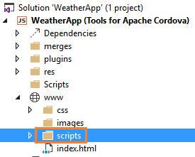

2. Right-click the **scripts** folder, and then choose **Add** -> **New JavaScript file**.

3. Name the file *weather.js*, and then choose the **Add** button.

4. Open the **weather.js** file and add the following function.

	```javascript       
    var WeatherApp = {};

    (function ($, ns, navigator) {
        ns.getWeather = function () {
            var zipcode = $('#zip-code-input').val();

            // get weather using zip code
            var queryString =
                'https://query.yahooapis.com/v1/public/yql?q='
                + 'select+*+from+weather.forecast+where+location='
                + zipcode + '&format=json';

            $.getJSON(queryString, function (results) {
                if (results.query.count > 0 && results.query.results.channel.wind) {
                    $('#error-msg').hide();
                    $('#weather-data').show();

                    var weather = results.query.results.channel;
                    $('#title').text(weather.title);

                    var wind = weather.wind;
                    $('#temperature').text(wind.chill);
                    $('#wind').text(wind.speed);

                    var atmosphere = weather.atmosphere;
                    $('#humidity').text(atmosphere.humidity);
                    $('#visibility').text(atmosphere.visibility);

                    var astronomy = weather.astronomy;
                    $('#sunrise').text(astronomy.sunrise);
                    $('#sunset').text(astronomy.sunset);

                    $('#summary img').attr('src', $(weather.item.description)[0].src);

                } else {
                    $('#weather-data').hide();
                    $('#error-msg').show();
                    $('#error-msg').text("Error retrieving data. " + results.query.results.channel.item.title);
                }
            }).fail(function (jqXHR) {
                $('#error-msg').show();
                $('#error-msg').text("Error retrieving data. " + jqXHR.statusText);
            });

            return false;
        }

    })($, WeatherApp, navigator);
	```

    This function gets a zip code from the input box, and uses a free service to get the weather for that zip code. The rest of this code uses JQuery syntax to populate controls on the page with data from the service.

    Now we're still missing a step. We have to refer to this new JavaScript file in our HTML page so let's do that now.

5. Open the **index.html** page, and add this reference to the ```<body>``` of the page (at the bottom of the body section, where the other JavaScript references are located).

	```html   
    <script src="scripts/weather.js"></script>
	```

    When you're done, your script reference should look something like the following.

	```html   
    <script src="scripts/jquery-2.2.0.min.js"></script>
    <script src="scripts/jquery.mobile-1.4.5.min.js"></script>
    <script src="cordova.js"></script>
    <script src="scripts/platformOverrides.js"></script>
    <script src="scripts/index.js"></script>
    <script src="scripts/weather.js"></script>
	```

6. Add ```https://query.yahooapis.com```, ```http://gws2.maps.yahoo.com``` and ```http://l.yimg.com``` to the page's Content Security Policy (CSP). The CSP is just a line of HTML that is located inside of the ```<head>```. Use it to declare approved origins of content that browsers should be allowed to load on your website. It looks like this:

    ```html
    <meta http-equiv="Content-Security-Policy" content="default-src 'self' data: gap:
    https://ssl.gstatic.com 'unsafe-eval'; style-src 'self' 'unsafe-inline'; media-src *">
    ```

    Add ```https://query.yahooapis.com```, ```http://gws2.maps.yahoo.com``` and ```http://l.yimg.com``` just after ```https://ssl.gstatic.com``` in that line to give this page permission to get content from the Yahoo weather service and map service. When you're done, your CSP will look like this:

    ```html
    <meta http-equiv="Content-Security-Policy" content="default-src 'self' data: gap:
    https://ssl.gstatic.com https://query.yahooapis.com http://gws2.maps.yahoo.com http://l.yimg.com 'unsafe-eval'; style-src 'self' 'unsafe-inline'; media-src *">
    ```

    > **Note:** Content Security Policy (CSP) is a computer security standard introduced to prevent cross-site scripting (XSS), clickjacking and other code injection attacks resulting from execution of malicious content in the trusted web page context. You can read more about it here: http://content-security-policy.com/

## Run your app in an Emulator

Let's run the app, but this time let's use an emulator.

1. In the list of Android emulators, choose the one of the **VS Emulator 5** to run your app.

    

    > **Note:** According to your PC configuration some warnings or errors may appear, like firewall alerts or message indicating that the emulator must run in elevated mode. If you receive the following error, stop the Android Debug Bridge process (adb.exe):

    > 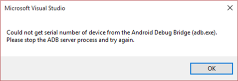

2. In the Android emulator, type a valid United States zip code into the edit box (for example: 98052), and then press the **Get Weather** button.

    Weather data for that region appears in the controls.

    

    What's great here is that this app is completely cross platform. If you have a little extra time, run this app in a Windows Phone emulator.

    > **Note:** You should test your app on as many physical devices (running on as many Operating System versions) as you can. Emulators and Simulators can behave different than a real device on certain circumstances and respond at different speeds. For example, an app may work in the simulator without a problem, but it may fail on a real device, or it can run faster on the device compared with an emulator. More information [here](https://cordova.apache.org/docs/en/4.0.0/guide/next/#testing-on-a-simulator-vs.-on-a-real-device).

## <a id="find-fix"></a>Find and fix problems

A big benefit of Visual Studio is its powerful debugger. If you're already familiar with it, you can skip this section. If you're not, let's take a quick tour of some things that you can do.

### Set breakpoints and conditional breakpoints

You can set a breakpoint on any line of executable code (including the JavaScript code). Look at the state of the Apache Cordova application, monitor variable values, and review call stacks.

 

### Use the JavaScript Console

This console appears when your Cordova app starts. If it doesn't, it's easy enough to open. Just choose **Debug** -> **Windows** -> **JavaScript Console**.

You can use the `console.log` method to log messages and then view those messages in the console. You can also use the console to execute any JavaScript function while the application is running. [Learn more about the JavaScript Console](https://developers.google.com/web/tools/javascript/console/).

### Use the Document Object Model (DOM) Explorer

Use the DOM Explorer to find and fix layout issues in your pages. Examine the structure of your pages as they render and then tweak them while the app is running.

To open the DOM Explorer, choose **Debug** -> **Windows** -> **DOM Explorer** while the app is running. [Learn more about the DOM Explorer](https://msdn.microsoft.com/library/dn255008.aspx).

 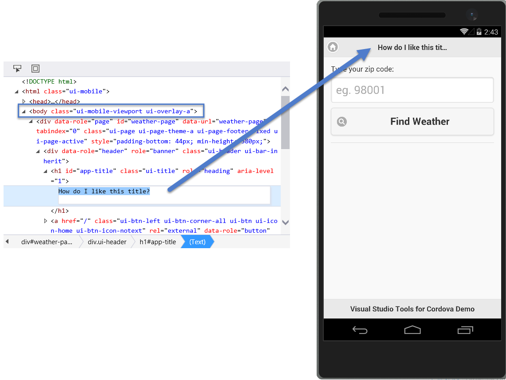

## <a id="capability"></a>Access a device capability

Most likely you'll want your app to do more than just show web pages on a mobile device. You might want your app to store files, receive push notifications, or capture images by using the device's camera. This is where a **plugin** becomes handy. Apache Cordova uses plugins to provide access to native device capabilities that aren’t available to simple web apps.

You can find some of the more commonly used plug-ins in the **Core** page of the app's [configuration designer](#settings).


[Cordova plugins registry](http://cordova.apache.org/plugins/) offers hundreds of other plugins. To add them, you'll have to edit the config.xml file directly. You can find guidance about how to do that  [here](/articles/develop-apps/manage-plugins.md/#AddOther).

Use the **Custom** page to add plugins that don't appear in the [Cordova plugins registry](http://cordova.apache.org/plugins/). These could be plugins that you or a colleague create for some specific purpose and then save to your local drive or to a GitHub repository.  [This document](/articles/develop-apps/manage-plugins.md/#Custom) explains how to add a custom plugin.

Let's add a plug-in that gives us access to the device's geolocation system. That way, we can get the weather of a user's current location.

1. Open the [configuration designer](#settings), and choose the **Plugins** tab.

2. Choose the **Geolocation** plugin, and then choose the **Add** button.

    

    This adds the plug-in to your project but you still have to know how to consume it in your app. To do that, open the **Readme.md** file. You'll find it in the **plugins** folder as shown in this image.

    

    Let's add some code that consumes this plugin.

3. In the **weather.js** file add the following code right after the ```getWeather``` function:

	 ```javascript
    ns.getLocation = function () {
        navigator.geolocation.getCurrentPosition(onGetLocationSuccess, onGetLocationError, { enableHighAccuracy: true });

        $('#error-msg').show();
        $('#error-msg').text('Determining your current location ...');

        $('#get-weather-btn').prop('disabled', true);
    }

    var onGetLocationSuccess = function (position) {
        var latitude = position.coords.latitude;
        var longitude = position.coords.longitude;

        // get zip code by using latitude and longitude.
        var queryString = 'http://gws2.maps.yahoo.com/findlocation?pf=1&locale=en_US&offset=15&flags=&q='
            + latitude + '%2c' + longitude + '&gflags=R&start=0&format=json';

        $.getJSON(queryString, function (results) {
            $('#error-msg').hide();

            if (results.Found > 0) {
                // put the zip code into the input box for the user if we get a location
                var zipCode = results.Result.uzip
                $('#zip-code-input').val(zipCode);
            }
        }).fail(function () {
            $('#error-msg').text('Error retrieving data.');
        }).always(function () {
            // always reset the UI even if we fail to get a ZIP code from the service.
            $('#get-weather-btn').prop('disabled', false);
        });
    }

    var onGetLocationError = function (error) {
        $('#error-msg').text('Error getting location. Leaving zip code field blank');
        $('#get-weather-btn').prop('disabled', false);
    }
    ```

    This code uses the device's geolocation capability to get the latitude and longitude of the device's location. It then uses the latitude and longitude to get a zip code for that location and then populate the input box of your app with that zip code.

4.  Open the **index.js** file, and add the following code to the `onDeviceReady` function.

	```javascript  
	WeatherApp.getLocation();
	```

    The ``onDeviceReady`` function should look like this.

	```javascript
	function onDeviceReady() {
		// Handle the Cordova pause and resume events
		document.addEventListener( 'pause', onPause.bind( this ), false );
		document.addEventListener('resume', onResume.bind(this), false);

        $('#get-weather').click(WeatherApp.getWeather);
        WeatherApp.getLocation();
	};
	```

6. Run the app.

    When your app starts, the label *Determining your current location ...* appears. After a brief period of time, the input box shows the zip code of your current location.

    > **Note**: If you use the Apache Ripple emulator, you’ll have to configure it with your location.

    > 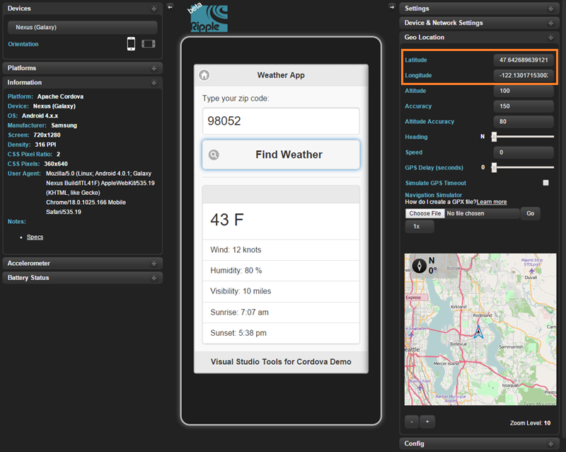

## <a id="tailor"></a>Tailor the app to a platform

The code that you used to get the device's location works pretty well across all platforms, but what if it didn't? What if you had to write extra code to get the location of an iOS device?

This is where the **merges** folder becomes useful. We touched on that folder earlier in this article. Now let's try a few basic things.

### Tailor the behavior of your app

1. In **Solution Explorer**, expand the **www** folder, and then the **scripts** folder.

2. Right-click the **weather.js** file, and choose **Copy**.

3. In **Solution Explorer**, expand the **android** sub-folder in your **merges** folder.

4. Right-click the **scripts** folder, and then choose **paste**.

    You now have a copy of the **weather.js** in the **android** folder.

    

5. In the **weather.js** file (located in the **merges/android/scripts** folder), add the following code to the ``getLocation`` method.

	```javascript
    $('#app-title').text("Android Weather");
	```

6. Run your app in the Apache Ripple Simulator.

    The app now has the title **Android Weather** because the **index.js** file in the **android** folder replaces the **index.js** file in the **www** folder for the Android version of your app.

    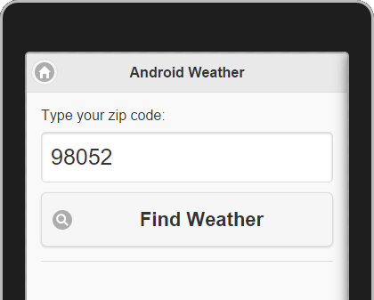

    Making a copy of a file this large to change one line of code is an extreme example, but you can begin to imagine the possibilities, and you can always refactor your code in ways that leverage the **merges** folder more efficiently.

    The readme file of each plug-in will tell you what sort of device-specific code you'll have to write.

### Tailor the appearance of your app

In some cases, you'll have to tweak the layout of your pages so that they appear correctly for one type of device or another.

1. Return to the **android** sub-folder in your **merges** folder.

2. Right-click the **android** folder, choose **Add** -> **New Folder**, and name the folder **css**.

3. Right-click the **css** folder, and then choose **Add** -> **New CSS file**.

4. Name the file *index.css*, and then choose the **Add** button.

    You now have a file named **index.css** in both the **android** folder and the **www** folder.

    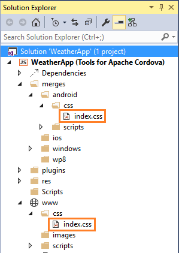

5. Replace the contents of the new **index.css** file with the following code.

	```css
    .not-displayed {
        display: none;
    }

    form {
        border-bottom: 1px solid #ddd;
        padding-bottom: 5px;
    }

    #zip-code-input {
        font-size: 25px;
    }

    #get-weather-btn {
        font-size: 22px;
    }

    #title {
        font-size: 16px;
    }

    #summary {
        font-size: 35px;
    }

    #summary img {
        float: right;
    }

    #error-msg {
        text-align: center;
        margin-top:  50%;
        font-weight: bold;    
    }

    .ui-bar-inherit.ui-header.header {
        background-color: #3388cc;
        border-color: #3388cc;
        color: #ffffff;
        text-shadow: 0 1px 0 #005599;
    }
	```

    Note that the styles defined are identical to the **www** version of the _index.css_ file, with the exception of these element:

    ````css
    .ui-bar-inherit.ui-header.header {
        background-color: #3388cc;
        border-color: #3388cc;
        color: #ffffff;
        text-shadow: 0 1px 0 #005599;
    }
    ````

    This is a simple example of what you can do by using the **merge** folder. A more effective approach would be to use a separate css file for platform-specific styles.

6. Run your app in the Apache Ripple Simulator.

    The app header has a blue background because the **index.css** file in the **android** folder replaces the **index.css** file in the **www** folder for the Android version of your app.

    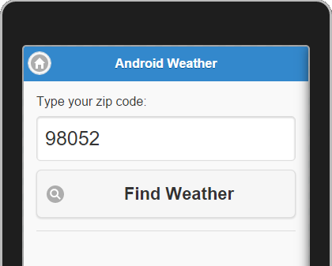


## <a id="next-steps"></a>Next steps

Congratulations on building your first cross-platform mobile app. Although this topic gets you started, there’s so much more to learn.

Here are a few ideas about what you can explore next on your journey to build mobile apps with HTML and JavaScript and Visual Studio.

**Explore the plug-in registry**

see [Search Cordova Plugins](http://cordova.apache.org/plugins/).

> **Tip:** If find a plugin that doesn't appear in the **Plugins** tab of configuration designer, you can still use it. [Learn more](./develop-apps/manage-plugins.md##AddOther).

**Try using Bower to add a package to your project**

see [Add packages by using Bower](tutorial-using-bower.md).

**Learn about other great ways to leverage the Visual Studio debugger**

see [Debugger Basics](https://msdn.microsoft.com/library/k0k771bt.aspx).

**Explore the many JavaScript frameworks out there**

Search online. They're everywhere! Here's a couple of them: [AngularJS](https://angularjs.org/), and [Ionic](http://ionicframework.com/).

**Get a Mac and then run your app in an iOS emulator, or on an iOS device**

See [Setup guide: Target iOS mobile devices in a Visual Studio Tools for Apache Cordova project](ios-guide.md).

**Tack on an Azure backend - it's free to try**

see [Connect a cloud service](./develop-apps/add-connected-services.md).

**Take a look at TypeScript - it's fully supported in your project**

see [Use TypeScript](./develop-apps/tutorial-typescript.md).
