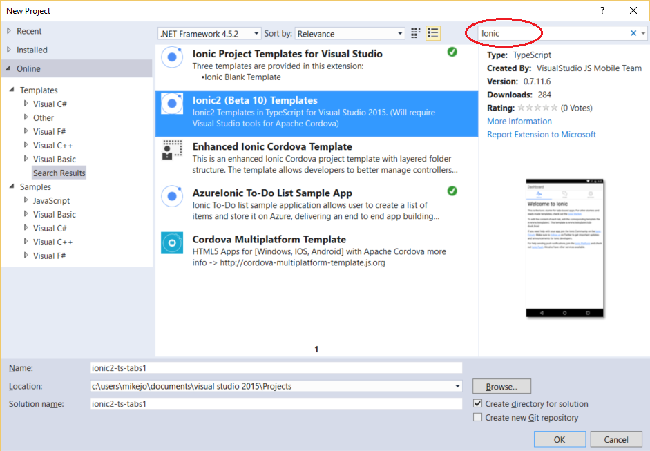
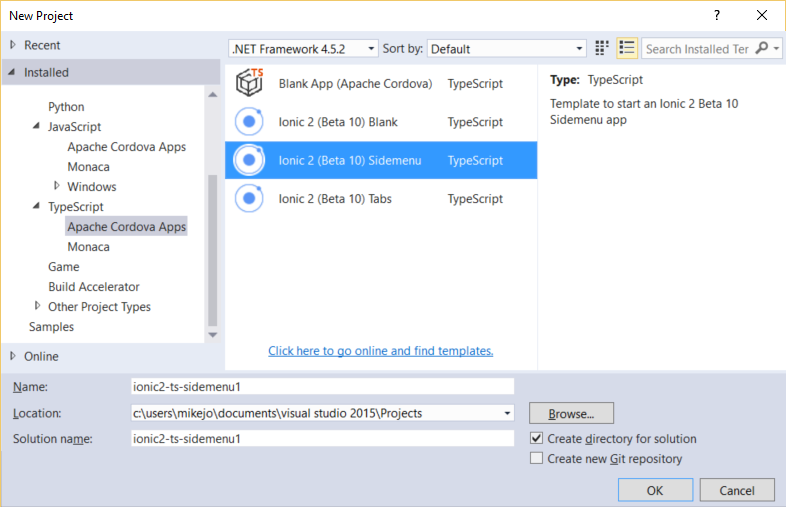
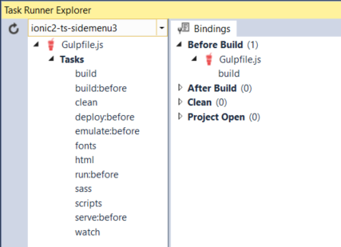
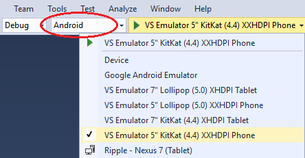
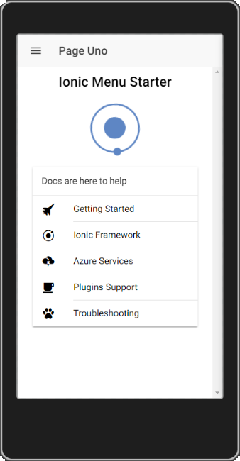
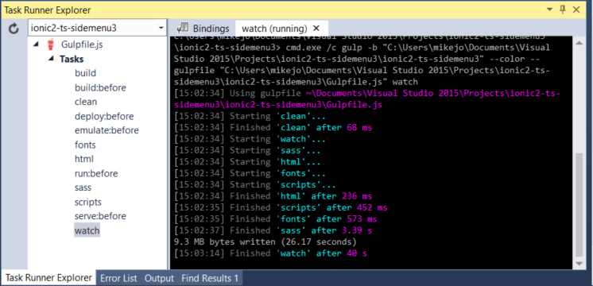
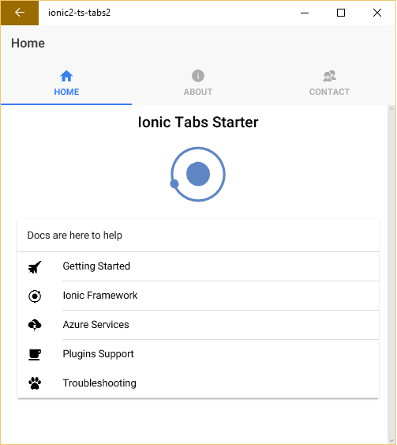

<properties pageTitle="Getting started with Ionic apps in Visual Studio"
  description="This is an article on ionic tutorial"
  services=""
  documentationCenter=""
  authors="mikejo5000" />
  <tags ms.technology="cordova" ms.prod="visual-studio-dev14"
     ms.service="na"
     ms.devlang="javascript"
     ms.topic="article"
     ms.tgt_pltfrm="mobile-multiple"
     ms.workload="na"
     ms.date="12/01/2015"
     ms.author="mikejo"/>

# Get started with Ionic 2 apps in Visual Studio <a name="video"></a>
[Ionic](http://www.ionicframework.com) is a popular front-end JavaScript framework for developing cross-platform mobile apps using Cordova. You can use Visual Studio 2015 to easily create and debug cross-platform Ionic apps.

## Get the Ionic 2 templates <a name="getTemplates"></a>

You can install the Ionic 2 starter templates in Visual Studio and use them to start building an app.

1. If you haven't already, [install Visual Studio 2015](http://go.microsoft.com/fwlink/?LinkID=533794).

    When you install Visual Studio, make sure you include the optional components, **HTML/JavaScript (Apache Cordova)** under Cross-Platform Mobile Development.

    > **Note:** Quickly verify that you can load and build the default Blank App template. In Visual Studio, choose **File**, **New**, **Project**, **JavaScript**, **Apache Cordova Apps**, **Blank App** and name the new project "blank", and build it with F5. If you have any issues, see these [troubleshooting steps](../tips-and-workarounds/general/tips-and-workarounds-general-readme.md).

2. Install the Ionic template in Visual Studio by selecting **File**, **New**, then **Project**. In the New Project dialog box, select **Online**. In the search box, type **Ionic**.

    

    Type any name and choose **OK** to install them. When you are asked for permission to install the templates, give your permission.

3. Close and re-open Visual Studio. Again, choose **File**, **New**, then **Project**. Now, when you choose **Installed**, then **Templates**, the new starter templates will show up under **TypeScript**, **Apache Cordova Apps**

    

    Choose one of the following starter templates for your new project:

    * Ionic 2 Blank App
    * Ionic 2 SideMenu Template
    * Ionic 2 Tabs Template

4. Choose **OK**.

    Visual Studio creates the Ionic project.

5. Wait until all npm packages have been restored.

    >**Note** This process will take some minutes depending on your machine and your internet connection speed.

    In the Dependencies node you should see a `Restoring Packages..` message. If you don't, right-click the **Dependencies** node and click **Restore Packages**.

    >**Note** Due to a bug, your dependencies under the node folder may show up as "not installed" after they have been restored. You will know restoration is finished when the typings folder has been added.

6.  If it does not open on its own, open the Visual Studio Task Runner Explorer by choosing **View** > **Other Windows** > **Task Runner Explorer** or by using Ctrl+Alt+Bkspce shortcut keys.

    

    The Task Runner executes your project’s Gulp tasks, which include taking the html, sass, and typescript files in your app folder and moving them to the www folder. The tasks must re-run whenever you make changes to your .ts files.

    When the Task Runner is open, these tasks should run automatically when you build. You can also run them manually by right-clicking on a task and choosing **Run**.

## Get your app running on Android <a name="configAndroid"></a>

1. Add the Android platform by **Android** as a debug target (Solution Platforms list), and then choosing **Build**, then **Build Solution**.

2. Choose **Android** as a debug target (Solution Platforms list), and to get the app running choose a target such as the **VS Emulator 5.1" Lollipop (5.1.1) XXHDPI Phone** (Hyper-V required) or the Google Android Emulator (slow to load initially).

    

    You can configure a Google Android emulator in [AVD Manager](../develop-apps/run-app-apache.md).

3. Press F5, and the app should load correctly.

    

3. Add live reload when running on Ripple.

    In the Task Runner under Bindings, right-click the **build** task, and choose **Remove**. Then, right-click the **watch** task in the left pane and choose **Run**.

    Now, when you make changes to your HTML and CSS source files, they will be automatically updated in the running app without a restart (Ripple only).

    

### Troubleshooting: Let's fix it

[You see an error that says Promise is not defined?](#node)

[Some node modules won't restore?](#node_modules)

[Visual Studio Emulator for Android won't run?](#vsAndroidEmu)

[Error saying that a Content Security Policy is missing?](#csp)

[Other issues?](#other)

## Get your app running on iOS <a name="configiOS"></a>

  You can run initially on the Ripple Emulator after selecting iOS as a debug target, but for detailed info on setting up the remotebuild agent for iOS, see [this topic](ios-guide.md).

  The Ionic starter templates should run correctly on iOS when the remotebuild agent is running on a Mac (or a service like MacInCloud), and when Visual Studio is configured to connect to it. (The complete steps are outside the scope here.)

## Get your app running on Windows <a name="configWin10"></a>

1. If it's not already installed, use the Visual Studio install program to install the **Universal Windows App Development Tools** (it should already be installed).

2. Choose **Build Solution** from the **Build** menu.

3. Open the configuration designer (config.xml) in Visual Studio, choose Windows, and in the **Windows Target Version**, choose  either **Windows 10.0** or **Windows 8.1**, and save changes.

4. Choose **Windows-x64** or **Windows-x86** from the Solution Platforms list.

5. Choose a Windows deployment target, such as **Local Machine** or **Mobile Emulator 10.0.xxxxx.0 WVGA 4 inch 1GB**.

6. Press F5 to run your app.

    

### Troubleshooting: Let's fix it

[You see an error that says Promise is not defined?](#node)

[Some node modules won't restore?](#node_modules)

[Get a message telling you to install a new app?](#partialpages)

[Certificate error on Windows](#certificate)

[Unhandled exception running on Windows?](#unhandled)

[appxrecipe file missing](#appxrecipe)

[Other issues?](#other)

## What's Next?

You can use Visual Studio's build and [debug tools](../debug-and-test/debug-using-visual-studio.md), use the configuration manager to easily [add device plugins](../develop-apps/manage-plugins.md) to your app to get up and running quick. To learn more about Ionic, see the Ionic framework docs.


## Troubleshooting: Let's fix it

A few errors are fairly common in the starter templates when debugging in Visual Studio.

### You see an error that says Promise is not defined? <a id="node"></a>

Your installed version of Node.js may not support Promises. To fix this, you need the current Visual Studio 2015 update (Update 3 or later) and Microsoft ASP.NET and Web Tools installed. Check for any notifications or warning icons in the upper right of Visual Studio and install these components, if instructed.


If you are unable to install the Web Tools:

1. [download them here](https://visualstudiogallery.msdn.microsoft.com/c94a02e9-f2e9-4bad-a952-a63a967e3935).

2. Run the following command from the folder containing the download:

    ```
    DotNetCore.1.0.0-VS2015Tools.Preview2.exe SKIP_VSU_CHECK=1
    ```
3. Create a new Ionic 2 project from the templates that you downloaded previously.

### Some node modules won't restore? <a id="node_modules"></a>

If you can't restore some of the Node.js modules, such as ionic-angular, make sure that you have installed the Update 3 or later of Visual Studio and Microsoft ASP.NET and Web Tools (for more instructions, see the [previous issue](#node)).

If that doesn't resolve the issue, open a command line and go to the project folder, then run this command:

    ```
    npm install
    ```
    and then this command:
    ```
    npm rebuild node-sass
    ```
Then create a new Ionic 2 project from the templates you downloaded previously.

### <a id="wwahost"></a>WWAHost runtime error?

When debugging on a Windows 8.1 dev machine, you may get a WWAHost runtime error when navigating between pages in Ionic apps. You can work around this by:

* Closing DOM Explorer before navigating pages, or

* Upgrading to Windows 10 on your dev machine (the platform issue is fixed in Windows 10).

### <a id="partialpages"></a>Get a message telling you to install a new app?

When you are using the AngularJS routing module (Ionic templates use this module) on Windows, you may need to include a call to `aHrefSanitizationWhitelist`. This will correct errors that occur when loading partial pages.

If you see the dialog box shown here, you have likely run into this issue.


Typically, you include the code fix in app.js or wherever you are calling your module configuration code (inside `angular.module.config`):

```
$compileProvider.aHrefSanitizationWhitelist(/^\s*(https?|ftp|mailto|file|ghttps?|ms-appx|ms-appx-web|x-wmapp0):/);

$compileProvider.imgSrcSanitizationWhitelist(/^\s*(https?|ftp|file|ms-appx|ms-appx-web|x-wmapp0):|data:image\//);
```
If you use the preceding code, then add a reference to $compileProvider in the following line of code.

```
.config(function ($stateProvider, $urlRouterProvider) {
  ```

so that it looks like this:

```
.config(function ($compileProvider, $stateProvider, $urlRouterProvider) {
  ```

### <a id="unhandled"></a>Unhandled exception running on Windows?

If you see the following unhandled exception when targeting Win/WinPhone 8.1, follow the [earlier steps](#configWindows) to call platformOverrides.js to fix this issue.


If you see the same error when targeting Windows 10, make sure you set **Windows 10.0** as the target in the Windows tab of the configuration designer.

### appxrecipe file missing <a id="appxrecipe"></a>

If you see this error when targeting Windows 10, make sure you set **Windows 10.0** as the target in the Windows tab of the configuration designer (config.xml). Then delete the platforms\windows folder and rebuild the project.

### <a id="csp"></a> Error saying that the Content Security Policy is missing?

Visual Studio will use the Cordova Whitelist plugin by default, so you need to update index.html in the Cordova app with the following `<meta>` element:

    ```
    <meta http-equiv="Content-Security-Policy" content="default-src 'self' data: gap: https://ssl.gstatic.com 'unsafe-eval'; style-src 'self' 'unsafe-inline'; media-src *">
    ```

### <a id="certificate"></a> Certificate error on Windows?

Make sure your credentials are up to date. Check for any notifications or warning icons in the upper right of Visual Studio.


You may need to re-enter your credentials. If the notifications indicate that you need to update Cordova tooling, please click on the notifications and follow instructions.

### <a id="vsAndroidEmu"></a> Visual Studio Emulator for Android won't run?

The VS Emulator for Android requires Hyper-V and is not supported when running on a VM. For more info, see [this information](https://msdn.microsoft.com/en-us/library/mt228282.aspx#NoStart2).

If you have previously run the VS Emulator for Android successfully but now the emulator won't run, try deleting the emulator VM instance in Hyper-V Manager. For more info, see [Troubleshooting] (https://msdn.microsoft.com/en-us/library/mt228282).

### <a id="other"></a> Other issues?

If you have errors running the Blank App template (rather than just the Ionic starter apps), try these steps.

1. In Visual Studio, go to **Tools**, **Options**, **Tools for Apache Cordova** and run the Dependency Checker.

    If the Dependency Checker finds any issues for a platform that you're targeting, you will need to fix them. If you need to install the Android SDK, use the [Android SDK Manager](http://taco.visualstudio.com/en-us/docs/configure-vs-tools-apache-cordova/#ThirdParty) to install API19 and API22.

2. If you see an error message in the Output window in Visual Studio, use any links provided to try to resolve the issue.

3. If that doesn't resolve issues, see these [troubleshooting tips](../tips-and-workarounds/general/tips-and-workarounds-general-readme.md). or post questions on [StackOverflow](http://stackoverflow.com/questions/tagged/visual-studio-cordova).
