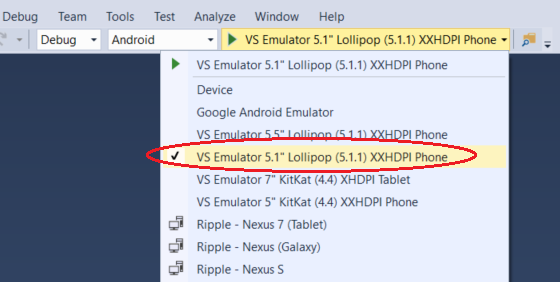
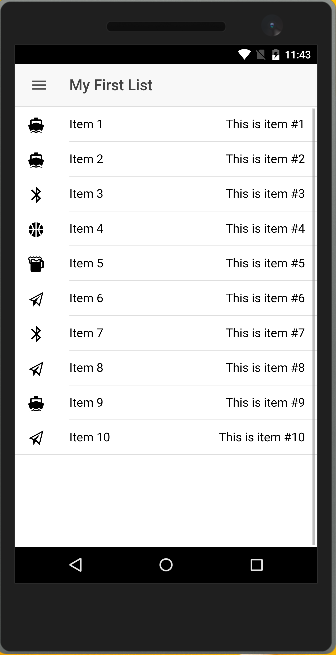
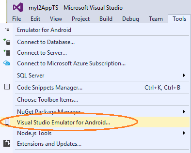

<properties pageTitle="Getting started with Ionic 2 in Visual Studio"
  description="This is an article on getting started with Ionic 2 in Visual Studio"
  services=""
  documentationCenter=""
  authors="mikejo5000" />
  <tags
     ms.service="na"
     ms.devlang="javascript"
     ms.topic="article"
     ms.tgt_pltfrm="mobile-multiple"
     ms.workload="na"
     ms.date="01/08/16"
     ms.author="mikejo"/>

# Get started with Ionic 2 in Visual Studio
[Ionic](http://www.ionicframework.com) is a popular front-end JavaScript framework for developing cross-platform mobile apps using Cordova. You can use Visual Studio 2015 and the Ionic CLI to easily create and debug cross-platform apps.

>**Note**: Ionic 2 is an alpha release and the Ionic 2 CLI is beta. We do not recommend that you use Ionic 2 for production apps.

## Set up your machine for Ionic with VS <a name="getStarted"></a>

To follow these steps, you must:

1. [Install the Ionic 2 CLI](http://ionicframework.com/docs/v2/getting-started/installation/).

    ```
    npm install -g ionic@beta
    ```

    The installation may take a few minutes, so make sure you allow it to finish.

2. [Install Visual Studio 2015](http://go.microsoft.com/fwlink/?LinkID=533794).

    When you install Visual Studio, make sure you include the optional components, **HTML/JavaScript (Apache Cordova)** under Cross-Platform Mobile Development.

3. To run a quick test of your setup, verify that you can run the default Blank App template.

    * In Visual Studio, choose **File**, **New**, **Project**, **JavaScript**, **Apache Cordova Apps**, **Blank App** and name the new project "blank".

    * Choose **Android**, **Ripple - Nexus (Galaxy)** (Chrome required) and press F5 to run the app (make sure the default blank app loads correctly). If any issues occur, use the error information and any links provided to resolve issues. Also, see the Troubleshooting tips in this article and in [Configure the Tools](configure-vs-tools-apache-cordova.md).

### Troubleshooting: Let's fix it

[Errors running the Blank App in Visual Studio?](#other)

## Get the Ionic 2 tutorial template <a name="getTemplates"></a>

1. Make sure you installed the Ionic 2 CLI, then open a command line.
2. Go to the directory where you want to install the Ionic starter app, such as a folder in the Documents folder.

    ```
    C:\\Users\<username>\Documents\myIonic2App>
    ```

3. In the command line, type

    ```
    ionic start myIonic2App tutorial --v2
    ```

    or, for the TypeScript version:

    ```
    ionic start myIonic2App tutorial --v2 --ts
    ```    

    Either command will install Ionic 2 and the required npm modules, including the Angular 2 module (there is no need to install this separately).

    Ionic creates the project in your current folder. Most of the Ionic 1 templates such as sidemenu and tabs are not available yet for Ionic 2, but if you need to use one you could read about [migrating](http://ionicframework.com/docs/v2/getting-started/migration/) Ionic 1 apps.

4. In the command line, type

    ```
    ionic serve
    ```

    This runs the app in your browser. You may be prompted to select an address, like localhost, before the app loads. You can use the browser for testing, but you will want to run on an emulator or device before long! Keep reading...

5. In the command line, type

    ```
    ionic run android
    ```

    This will install the required Android platform dependencies for Ionic 2 apps. (If you already have an Android emulator running, the app should also load on the emulator at this point. But otherwise, we will try to run on the emulator later.)

    You can run the same command for iOS (`ionic run ios`), but to work in Visual Studio on Windows you will need to also [install the remote agent](ios-guide.md). We are not covering those tasks here.

## Import the project into VS <a name="configTemplates"></a>

For the Ionic 2 tutorial app, do this:

1. In Visual Studio, choose **File**, **New**, **Project From Existing Code**.

2. In the wizard, choose **Apache Cordova** as the project type that you'd like to create, and then choose **Next**.

    

3. For the **Project file location**, browse to the root folder of the Ionic tutorial project and select it.

    

4. Type a name for your new project and select **Finish**.

    Visual Studio adds a few new files to the project. Wait for Bower/NPM updates to the project to finish, if necessary.

## Get your app running on Android from Visual Studio

1. Open index.html and include the following `<meta>` element.

    ```
    <meta http-equiv="Content-Security-Policy" content="default-src 'self' data: gap: https://ssl.gstatic.com 'unsafe-eval'; style-src 'self' 'unsafe-inline'; media-src *">
    ```

    This Content-Security-Policy will satisfy Cordova 5 security requirements.

2. Choose **Android** as a debug target (Solution Platforms list), and to get the app running choose a target such as Ripple (Chrome required) or the **VS Emulator 5.1" Lollipop (5.1.1) XXHDPI Phone** (Hyper-V required).

    

    If you do not have Hyper-V, you can choose the Google emulator (not very fast), set up the GenyMotion emulator, or use a device. For more info, see [this article](../develop-apps/run-app-apache.md).

2. Press F5, and the app should load correctly.

    

### Troubleshooting: Let's fix it

[See a blank screen when you run the app?](#blank)

[Don't see any Android 5.1 emulators in Visual Studio?](#missingEmu)

[Visual Studio Emulator for Android won't run?](#vsAndroidEmu)

[App is not working right on Android 4.4?](#android44)

[Want to target ES6?](#es6)

[Error saying that a Content Security Policy is missing?](#csp)

[Other issues?](#other)

## Get your app running on iOS from Visual Studio <a name="configiOS"></a>

  You can run initially on the Ripple Emulator after selecting iOS as a debug target, but for detailed info on setting up the remotebuild agent for iOS, see [this topic](ios-guide.md).

  The Ionic 2 tutorial app should run correctly on iOS when the remotebuild agent is running on a Mac, and when Visual Studio is configured to connect to it. (The complete steps are outside the scope here.)

## Get your app running on Windows 10 from Visual Studio

1. In the command line, type

    ```
    ionic run windows
    ```

    This installs required platform dependencies for Windows 10.

4. In Visual Studio, right-click config.xml and choose **View Designer** to open the configuration designer.

5. In the configuration designer (config.xml), choose **Windows**, and in the **Windows Target Version**, choose  **Windows 10.0**, and save changes.

6. Choose a **Windows-Any CPU** as a platform, and a Windows 10 deployment target such as **Window **Mobile Emulator 10.0.xxxxx.0 WVGA 4 inch 1GB**.

7. Press F5 to run your app.

## Troubleshooting: Let's fix it

[See a blank screen when you run the app?](#blank)

[Certificate error on Windows?](#certificate)

[Error saying that a Content Security Policy is missing?](#csp)

[Other issues?](#other)

### <a id="blank"></a>See a blank screen when you run the app?

If you get a blank screen, you may also see a ERR_FILE_NOT_FOUND error in the Output window. If you see this issue, try these steps:

1. Run an emulator from Visual Studio and leave it running (VS Emulator for Android or Google emulator).

2. Press Shift + F5 to stop debugging.

3. Open a command line, go to the directory where you installed the tutorial app, and type this:

    ```
    ionic run android
    ```

    or

    ```
    ionic run windows
    ```  

4. Press F5 to retry running your app.

### <a id="missingEmu"></a> Don't see any Android 5.1 emulators in Visual Studio?

The current version of the Ionic 2 tutorial app works best on Android 5.1 and later versions. If you installed the Visual Studio Emulator for Android, but don't see any 5.1 emulators, follow these steps.

1. Choose **Tools**, **Visual Studio Emulator for Android**.

    

2. If you see a message to install emulator updates, install them.

3. If you don't have any device profiles for Android 5.1 installed, use the Device Profiles page to install the updates.

### <a id="vsAndroidEmu"></a> Visual Studio Emulator for Android won't run?

The VS Emulator for Android requires Hyper-V and is not supported when running on a VM. For more info, see [this information](https://msdn.microsoft.com/en-us/library/mt228282.aspx#NoStart2).

If you have previously run the VS Emulator for Android successfully but now the emulator won't run, try deleting the emulator VM instance in Hyper-V Manager. For more info, see [Troubleshooting] (https://msdn.microsoft.com/en-us/library/mt228282).

### <a id="android44"></a> App is not working right on Android 4.4?

The current version of the Ionic 2 tutorial app works best on Android 5.1 and later versions. You can try to include the Crosswalk plugin using the configuration designer, which may provide better support for Android 4.4.

1. Open config.xml, choose the Plugins tab.

2. Choose the Crosswalk Webview and choose **Add**.

### <a id="csp"></a> Error saying that the Content Security Policy is missing?

Visual Studio will use the Cordova Whitelist plugin by default, so you need to update index.html in the Cordova app with the following <meta> element:

    ```
    <meta http-equiv="Content-Security-Policy" content="default-src 'self' data: gap: https://ssl.gstatic.com 'unsafe-eval'; style-src 'self' 'unsafe-inline'; media-src *">
    ```

### <a id="es6"></a> Want to target ES6?

Ionic 2 supports ES6 but the app targets ES5 by default. You can change the default target to ES6 by opening the tsconfig.json file and changing the target attribute to es6 instead of es5.

### <a id="certificate"></a> Certificate error on Windows?

Make sure your credentials are up to date. Check for any notifications or warning icons in the upper right of Visual Studio.


You may need to re-enter your credentials. If the notifications indicate that you need to update Cordova tooling, please click on the notifications and follow instructions.

### <a id="other"></a> Other issues?

If you have errors running the Blank App template (rather than just the Ionic 2 tutorial template), try these steps.

1. In Visual Studio, go to **Tools**, **Options**, **Tools for Apache Cordova** and run the Dependency Checker.

    If the Dependency Checker finds any issues for a platform that you're targeting, you will need to fix them. If you need to install the Android SDK, use the [Android SDK Manager](http://taco.visualstudio.com/en-us/docs/configure-vs-tools-apache-cordova/#ThirdParty) to install API19 and API22.

2. If you see an error message in the Output window in Visual Studio, use any links provided to try to resolve the issue.

3. If that doesn't resolve issues, follow instructions to [clear the Cordova cache](http://taco.visualstudio.com/en-us/docs/configure-vs-tools-apache-cordova/#vstac). Otherwise, see [Known Issues](http://taco.visualstudio.com/en-us/docs/known-issues-general/) or post questions on [StackOverflow](http://stackoverflow.com/questions/tagged/visual-studio-cordova).
