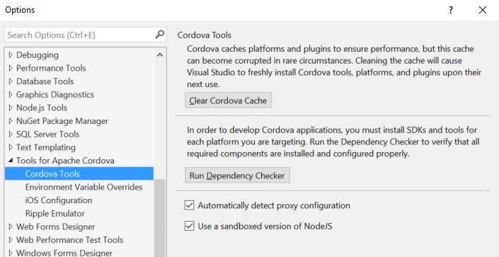

<properties pageTitle="Release Notes for Update 8"
  description="Release notes for Update 8 of Visual Studio 2015 Tools for Apache Cordova"
  services=""
  documentationCenter=""
  authors="rido-min" />
  <tags
     ms.service="na"
     ms.devlang="javascript"
     ms.topic="article"
     ms.tgt_pltfrm="mobile-multiple"
     ms.workload="na"
     ms.date="03/08/2016"
     ms.author="rmpablos"/>

#**Update 8 - Visual Studio Tools for Apache Cordova**
Update 8 corresponds to Visual Studio Tools for Apache Cordova version number 14.0.60311.2 and will be included with Visual Studio Update 2.

## Setup Instructions
The most common way to get this update will be the Notification Icon in VS and the Tools & Extensions Updates. For now, with the pre-release of this update we are also offering a standalone installer that you can find here:

[Visual Studio Tools for Apache Cordova Update 8 Download](http://go.microsoft.com/fwlink/?LinkId=746890)

Please note that this installer will require you to have already installed a previously version of VS TACO.

## New Features:

### Node Sandboxing
We have seen version conflicts with NPM over time and to help isolate these issues we’re now shipping a known version of NPM, sandboxed with the VS installation. (This was also done for NPM in the previous Update 7 release)

### NPM Proxy
We’ve seen a number of issues come up with customers running our tools behind a proxy. NPM proxy settings are often an issue and so now, if there is a proxy configured at the system level, we auto-apply that same configuration to NPM when we use it.

### Updated Plugins List
The list of the most commonly used plugins, included on the config.xml designer, has been updated. Along with this update, the `com.microsoft.azure-mobile-services` plugin is replaced with the new `cordova-plugin-ms-azure-mobile-apps` plugin.

Here are the new plugins added to the config.xml designer:

- `cordova-plugin-ms-azure-mobile-apps`
- `cordova-plugin-hockeyapp`
- `cordova-plugin-code-push`
- `cordova-plugin-bluetoothle`
- `phonegap-plugin-push`
- `cordova-plugin-ms-azure-mobile-engagement`

## Bug Fixes
This release fixes three bugs that will improve the performance of the build process:

### Remote_ios.json gets corrupted when a lot of plugins are installed
Some users reported problems executing remote builds for iOS, that was caused by an incomplete remote_ios.json file, that was affecting users with a lot of plugins. Now we have optimized the remote build configuration and  are no longer using this file.

### Building for Ripple does an extra cordova prepare
We found that in some cases targeting Ripple during build will call Cordova prepare twice, increasing build time. This issue has been fixed in update 8.

###  Deploying for Android emulator using Cordova 6.0.0 does a second build during deploy
Again, in some cases, deploying to the Android emulator sometimes triggered a second build. We have fixed this issue in Update 8.
